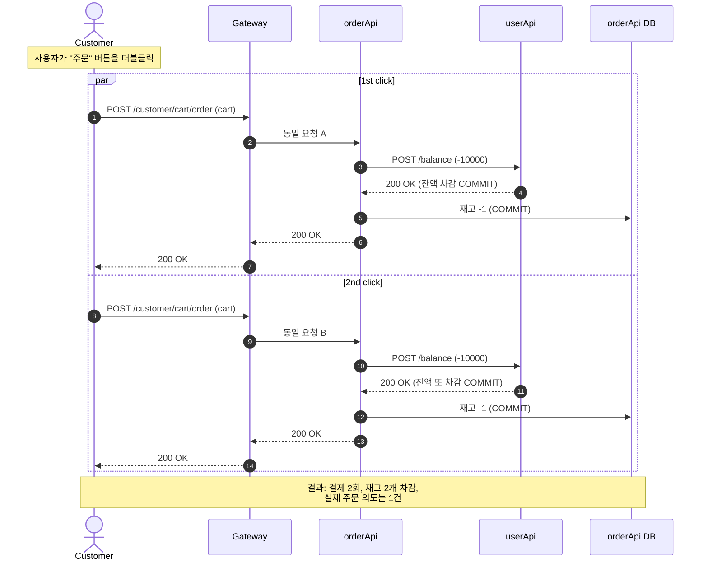
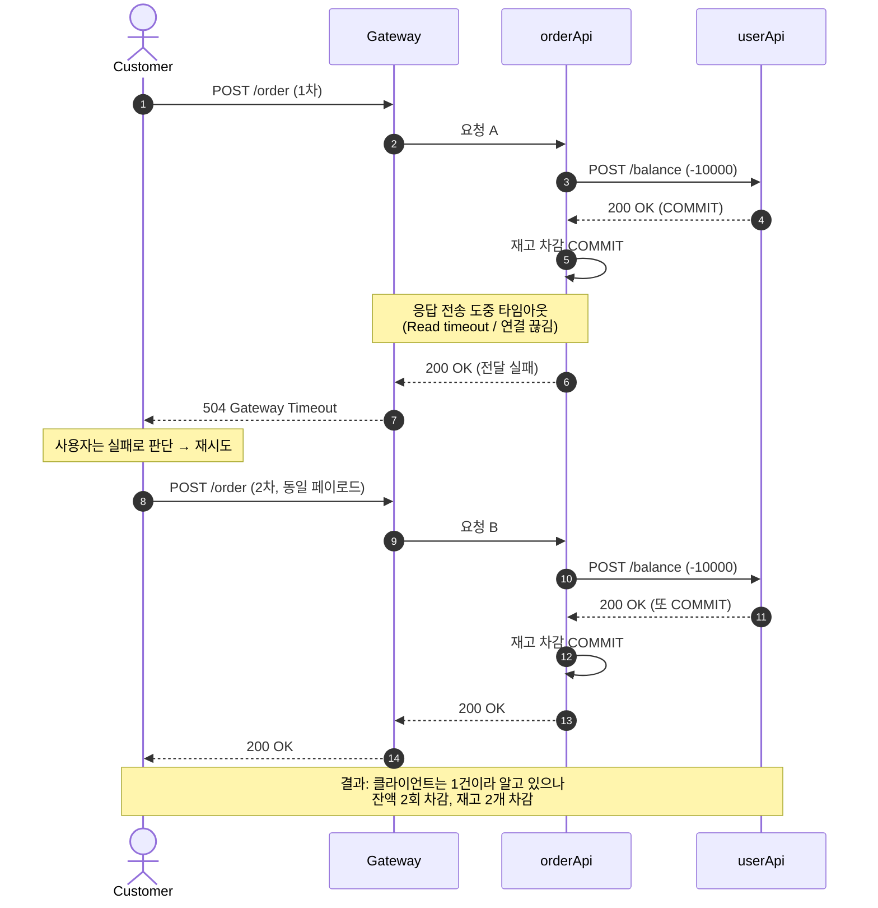
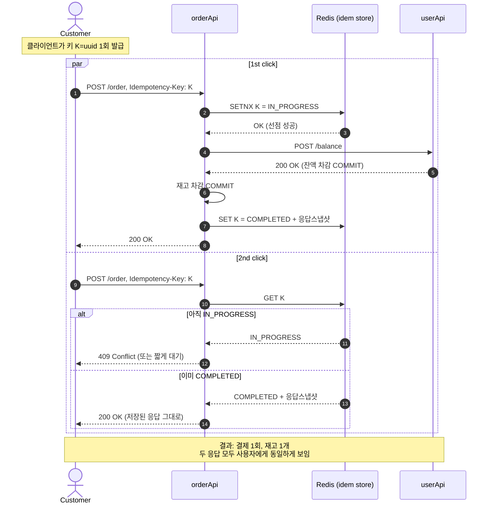
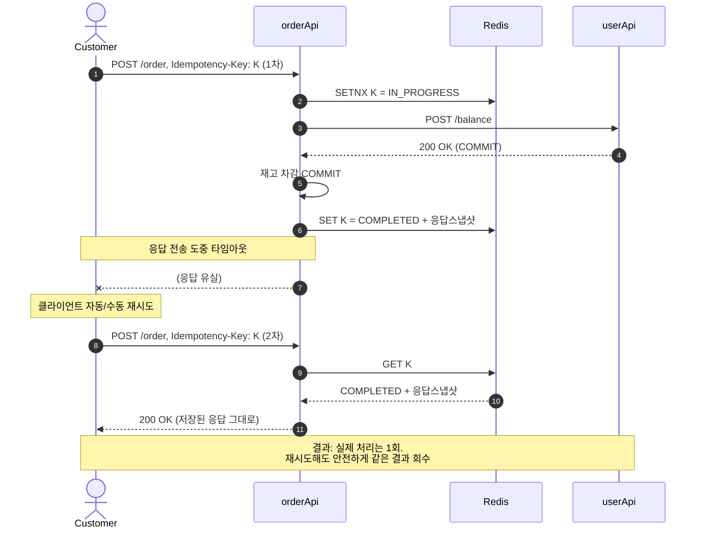

# ADR 001: 멱등성(Idempotency) 기반 이중 결제 방지

- 상태: 제안 (Proposed)
- 작성일: 2026-05-22
- 관련 코드: [orderApi/.../OrderService.java](../orderApi/src/main/java/com/zerobase/orderApi/service/OrderService.java), [orderApi/.../CustomerCartController.java](../orderApi/src/main/java/com/zerobase/orderApi/controller/CustomerCartController.java)

## 컨텍스트

현재 주문 흐름은 다음과 같다.

```
client → gateway → orderApi POST /customer/cart/order
                       ├── (1) userApi POST /balance        (잔액 차감)
                       └── (2) productItemRepository.save() (재고 차감)
```

- 클라이언트, gateway, 브라우저 모두 재시도(retry)를 할 수 있는 지점이 존재한다.
- 주문 요청을 식별할 수 있는 키(주문 요청 ID, Idempotency-Key 등)가 현재 **존재하지 않는다**. 동일한 페이로드의 두 요청은 서버 입장에서 구분할 수 없다.

## 멱등성을 도입하지 않을 경우 발생하는 문제

### 시나리오 1. 클라이언트/사용자에 의한 중복 제출 (Double-Click)

사용자가 "주문" 버튼을 빠르게 두 번 누르거나, 응답이 느려 새로고침/재요청을 하는 경우 동일한 주문이 두 번 처리된다.



문제점: **잔액 2회 차감 + 재고 2개 차감**. 사용자는 1건만 주문한 것으로 인지.

---

### 시나리오 2. 네트워크 타임아웃 후 클라이언트 재시도

orderApi 가 응답을 준비하는 동안 클라이언트(또는 gateway, ALB) 가 타임아웃되어 같은 요청을 다시 보낸다. 첫 요청은 서버에서 **정상 처리되어 커밋됨에도** 클라이언트는 실패로 판단한다.



문제점: **사용자는 1건 주문 / 시스템은 2건 처리**. 클라이언트가 자동 재시도 로직을 두는 순간 더 심각해진다.

---

## 종합

| 시나리오 | 트리거 | 결과 |
|---|---|---|
| 1. 더블클릭 | 사용자 UX | 결제·재고 2배 |
| 2. 클라이언트 타임아웃 재시도 | 네트워크 지연 | 결제·재고 2배 |

공통 원인: **요청을 식별할 멱등 키가 없고**, 처리 결과가 캐시되지 않아 동일 의도의 요청을 서버가 구분할 수 없음.

## 결정 (제안)

`POST /customer/cart/order` 에 `Idempotency-Key` 헤더를 도입하고, 결과(성공/실패 응답 본문)를 일정 기간(예: 24h) 저장하여 동일 키 재요청 시 **저장된 응답을 그대로 반환**한다. 저장소는 이미 도입되어 있는 Redis 를 1차 후보로 한다. 구체적 설계는 후속 ADR 에서 다룬다.

---

## 멱등성 도입 후 시나리오

전제:
- 클라이언트는 주문 의도가 생긴 시점에 **UUID v4 형태의 `Idempotency-Key` 를 1회 발급**하여 재시도 시에도 동일한 키를 사용한다.
- orderApi 는 키 단위로 **`IN_PROGRESS` → `COMPLETED` 상태 + 응답 스냅샷**을 Redis 에 저장한다. (TTL 예: 24h)
- 동일 키의 신규 요청은 다음 규칙으로 처리한다.
  - 키가 없으면: `IN_PROGRESS` 로 선점(SETNX) 후 본 처리 진행
  - `IN_PROGRESS` 면: `409 Conflict` (또는 동일 키 잠금 대기)
  - `COMPLETED` 면: 저장된 응답을 그대로 재전송 (재처리 없음, 성공/실패 무관)
- **실패 응답도 캐시된다.** 실패한 주문을 다시 시도하려면 클라이언트가 새 키를 발급해야 한다.

### 시나리오 1'. 더블클릭 (해결)



---

### 시나리오 2'. 클라이언트 타임아웃 후 재시도 (해결)



---

## 도입 후 종합

| 시나리오 | 도입 전 | 도입 후 |
|---|---|---|
| 1. 더블클릭 | 결제·재고 2배 | 409 또는 저장된 응답 1건 |
| 2. 클라 타임아웃 재시도 | 결제·재고 2배 | 저장된 응답 회수, 처리 1회 |

남는 책임:
- **클라이언트**: 주문 의도 단위로 키를 1회 발급하고 재시도 시 동일 키 사용
- **orderApi**: 키 생명주기(IN_PROGRESS / COMPLETED) 와 응답 스냅샷 보관
