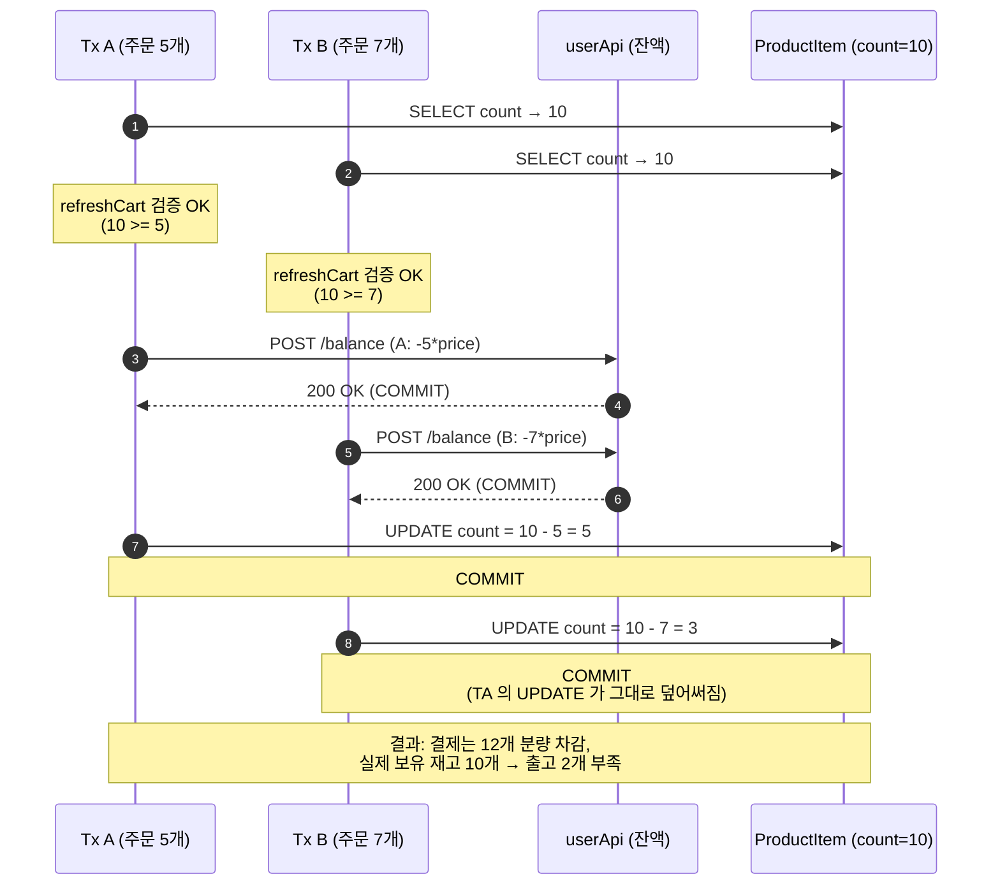
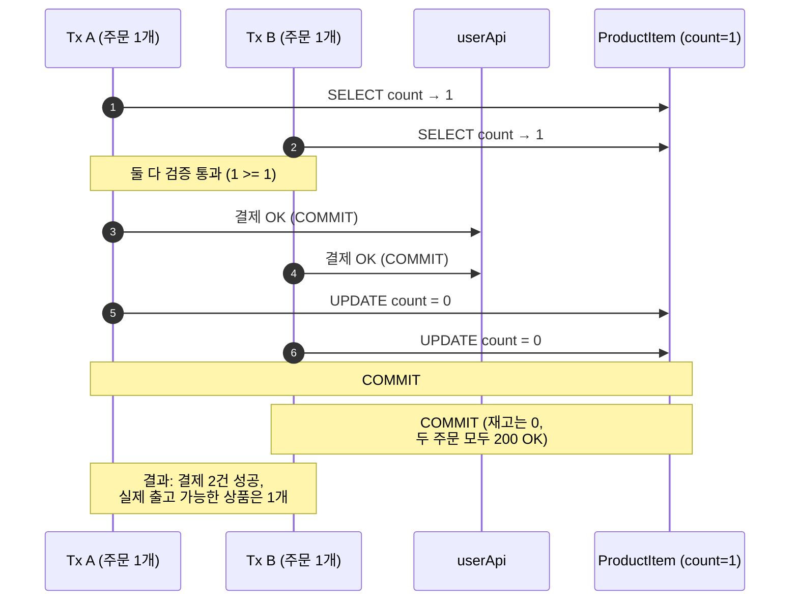
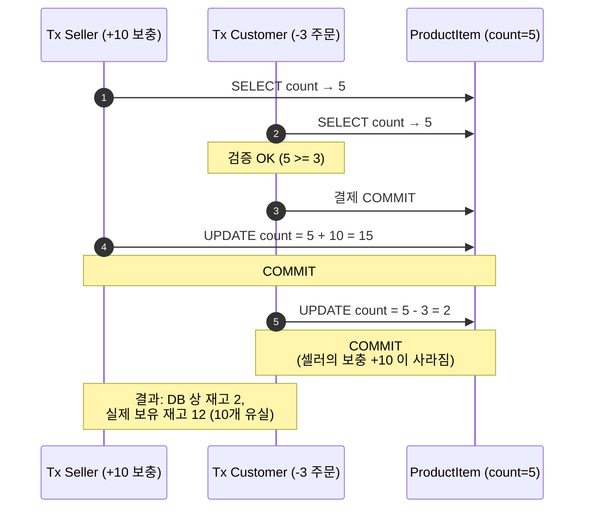
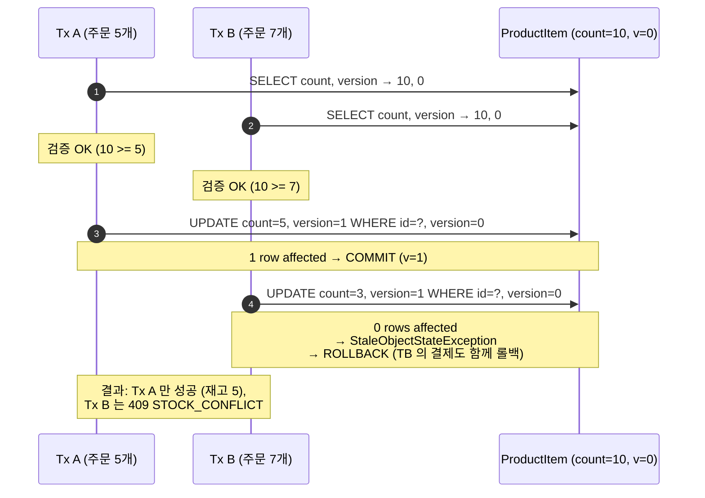
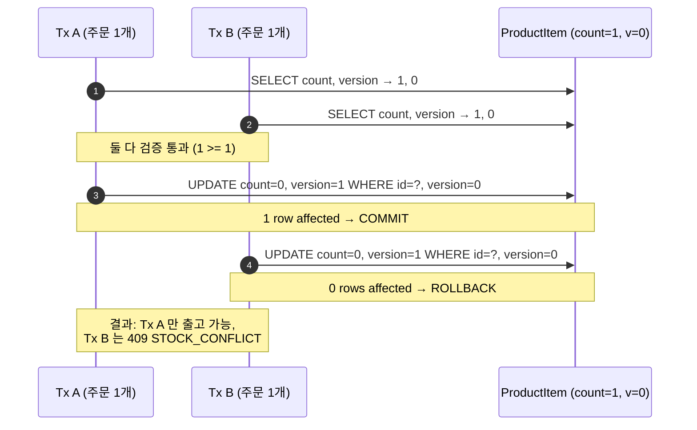
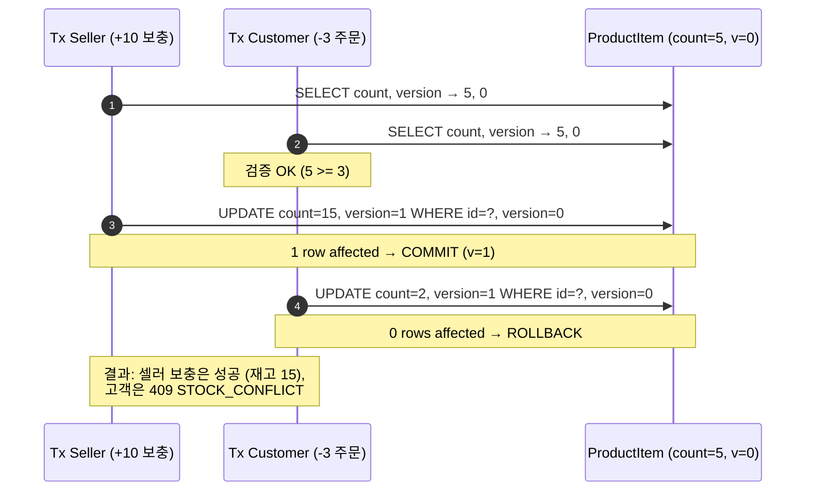

# ADR 002: 낙관적 락(Optimistic Lock) 기반 재고 차감 동시성 제어

- 상태: 제안 (Proposed)
- 작성일: 2026-05-23
- 관련 코드: [orderApi/.../OrderService.java](../orderApi/src/main/java/com/zerobase/orderApi/service/OrderService.java), [orderApi/.../ProductItem.java](../orderApi/src/main/java/com/zerobase/orderApi/domain/ProductItem.java)

## 컨텍스트

`OrderService.order()` 의 재고 차감 흐름은 다음과 같다 ([OrderService.java:104-111](../orderApi/src/main/java/com/zerobase/orderApi/service/OrderService.java#L104-L111)).

```java
// 결제 성공 이후
orderCart.getProductList().stream()
    .flatMap(p -> p.getProductItemList().stream())
    .forEach(it -> {
        ProductItem item = productItemRepository.findById(it.getId()).get();
        item.setCount(item.getCount() - it.getCount()); // dirty checking → UPDATE
    });
```

- `ProductItem` 엔티티에는 **현재 `@Version` 필드가 없다** ([ProductItem.java](../orderApi/src/main/java/com/zerobase/orderApi/domain/ProductItem.java)). JPA 는 단순 `UPDATE product_item SET count = ? WHERE id = ?` 를 발행한다.
- 검증(`cartService.refreshCart`) → 결제(`userClient.changeBalance`) → 재고 조회 → 재고 차감 사이에 **다른 트랜잭션이 동일 `ProductItem.count` 를 변경할 수 있는 윈도우** 가 존재한다.
- DB 격리 수준은 MySQL 기본값(`REPEATABLE READ`) 으로, 같은 트랜잭션 내 반복 조회 일관성은 보장되지만 **두 트랜잭션의 read–modify–write 시퀀스 자체는 직렬화되지 않는다**. 마지막에 커밋한 트랜잭션의 UPDATE 가 앞선 트랜잭션의 변경을 그대로 덮어쓴다(Lost Update).

## 낙관적 락을 도입하지 않을 경우 발생하는 문제

### 시나리오 1. 동시 주문에 의한 재고 Lost Update (초과 판매)

재고 10개인 `ProductItem` 을 사용자 A 가 5개, 사용자 B 가 7개 거의 동시에 주문하는 경우.



문제점:

- 두 결제 모두 정상 커밋되어 사용자 A, B 의 잔액에서 합산 12 개 분량이 차감됨.
- DB 상 재고는 `3` 으로 보이지만, **실제 차감되었어야 할 양은 12 (= 5 + 7) 이므로 재고는 `-2` 여야 했다**.
- 셀러 입장에서 12 개 출고 요청을 받지만 보유분은 10 개 → 2 개를 강제 환불 / 출고 지연 처리해야 함.
- DB 의 `count` 값이 실제 물리 재고와 영구적으로 어긋난다(데이터 일관성 손상).

---

### 시나리오 2. 마지막 1개 재고를 두 사용자가 동시 구매

재고 1개인 `ProductItem` 을 A 와 B 가 동시에 1 개씩 주문.



문제점: 두 사용자 모두 `200 OK` 를 받았으나 셀러는 1 개만 보유. **한 사용자에게 사후 환불·취소·출고 지연 보상**이 강제된다. 멱등성([ADR 001](./001-idempotency-double-payment-prevention.md)) 만으로는 막을 수 없는 경합이다 — 두 요청의 `Idempotency-Key` 는 서로 다르기 때문.

---

### 시나리오 3. 셀러 재고 보충과 고객 주문의 충돌

셀러가 재고를 5 → 15 로 보충하는 동안 고객 주문 트랜잭션이 동시 진행되는 경우.



문제점: 셀러가 보충한 10 개가 DB 상 사라진다. 반대 순서(셀러 UPDATE 가 나중에 커밋) 라면 고객의 차감이 사라진다. **재고 = 물리 보유량** 이라는 불변식이 깨진다.

---

## 종합

| 시나리오 | 트리거 | 결과 |
|---|---|---|
| 1. 동시 주문 Lost Update | 두 고객의 동시 주문 | 결제는 정상, 재고 음수 누락 → 초과 판매 |
| 2. 마지막 재고 동시 구매 | 두 고객의 동시 주문 | 둘 다 200 OK, 한 명에게 사후 환불 강제 |
| 3. 셀러 보충 ↔ 고객 주문 충돌 | 셀러/고객 동시 작업 | 셀러 보충 또는 고객 차감 유실 |

공통 원인: `ProductItem.count` 에 대한 read–modify–write 가 **직렬화되지 않으며**, 충돌을 감지할 수 있는 버전 메타데이터가 없다. 멱등성([ADR 001](./001-idempotency-double-payment-prevention.md)) 은 "같은 요청의 중복 처리" 를 막을 뿐, "서로 다른 요청 간 경합" 은 막지 못한다.

## 결정 (제안)

`ProductItem` 에 `@Version Long version` 필드를 추가한다. JPA 가 발행하는 UPDATE 는 `... WHERE id = ? AND version = ?` 형태가 되어, 충돌 시 `OptimisticLockException` 이 발생한다. 이를 `CustomException(ErrorCode.STOCK_CONFLICT)` 으로 변환해 동시성 충돌을 명시적으로 드러낸다.

---

## 낙관적 락 도입 후 시나리오

전제:
- `ProductItem` 에 `@Version Long version` 필드가 존재. JPA 는 UPDATE 마다 `WHERE id = ? AND version = ?` 조건과 `version = version + 1` 을 함께 발행한다.
- 두 트랜잭션이 같은 `version` 으로 row 를 읽고 각자 변경을 시도하면, **먼저 커밋한 쪽만 성공**하고 늦은 쪽의 UPDATE 는 0 rows affected 가 되어 Hibernate 가 `StaleObjectStateException` → Spring `ObjectOptimisticLockingFailureException` 으로 던진다.
- `CustomExceptionHandler` 가 이를 `STOCK_CONFLICT` (HTTP 409) 로 변환하여 클라이언트에 반환한다.

### 시나리오 1'. 동시 주문 Lost Update (해결)



문제 해결: 두 번째로 커밋을 시도한 트랜잭션은 **재고 차감이 일어나지 않은 채** 트랜잭션 전체가 롤백된다. 클라이언트 B 는 409 응답을 받고 재시도하면 그때의 실제 재고(5) 기준으로 다시 검증된다. 재고 음수 누락 / 초과 판매가 원천 차단된다.

---

### 시나리오 2'. 마지막 1개 재고 동시 구매 (해결)



문제 해결: 한 명만 성공적으로 결제·재고 차감이 일어나고, 다른 한 명은 결제까지 함께 롤백된다. 사후 환불·취소 보상 작업이 필요 없다.

---

### 시나리오 3'. 셀러 보충 ↔ 고객 주문 충돌 (해결)



문제 해결: 셀러 보충과 고객 주문 중 한쪽만 커밋되며, 늦은 쪽은 롤백된다. **재고 = 물리 보유량** 불변식이 유지된다.

---

## 도입 후 종합

| 시나리오 | 도입 전 | 도입 후 |
|---|---|---|
| 1. 동시 주문 Lost Update | 결제 정상, 재고 음수 누락 → 초과 판매 | Tx A 성공 / Tx B 409 STOCK_CONFLICT, 재고 정합 |
| 2. 마지막 재고 동시 구매 | 둘 다 200 OK, 한 명 사후 환불 강제 | 한 명 성공 / 한 명 409, 사후 보상 불필요 |
| 3. 셀러 보충 ↔ 고객 주문 충돌 | 한쪽 변경 유실 | 늦은 쪽 롤백, 불변식 유지 |

남는 책임:
- **클라이언트**: 409 STOCK_CONFLICT 수신 시 재고 재조회 후 사용자에게 안내·재시도 유도
- **orderApi**: `@Version` 으로 재고 row 의 동시성 일관성만 보장. 결제(`userClient.changeBalance`) 와 재고 차감 사이의 분산 트랜잭션·보상은 본 ADR 의 범위 밖.
