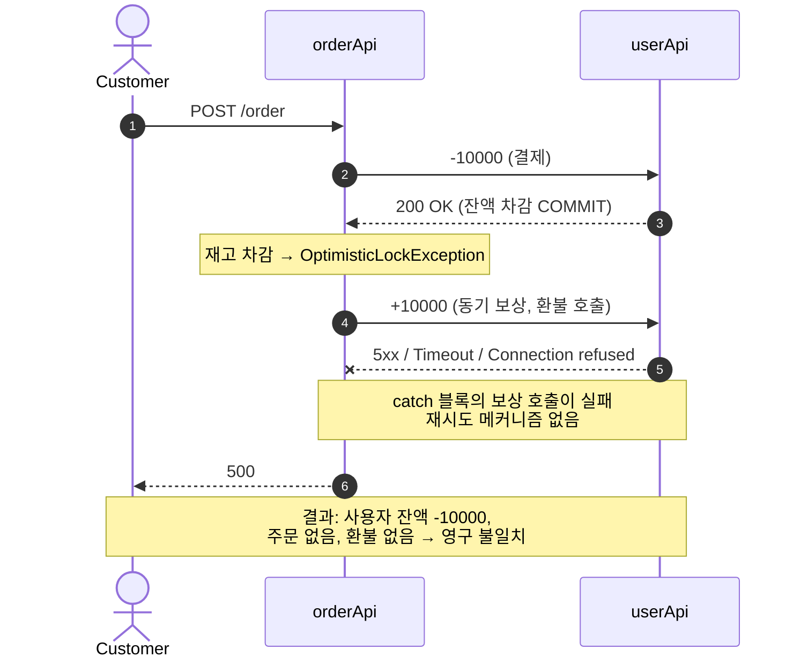
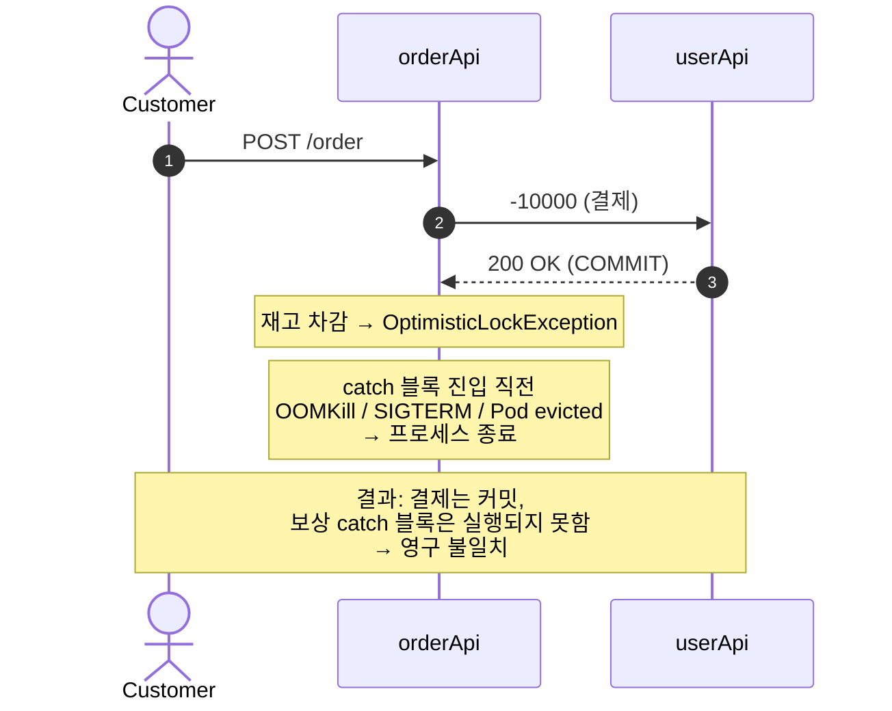
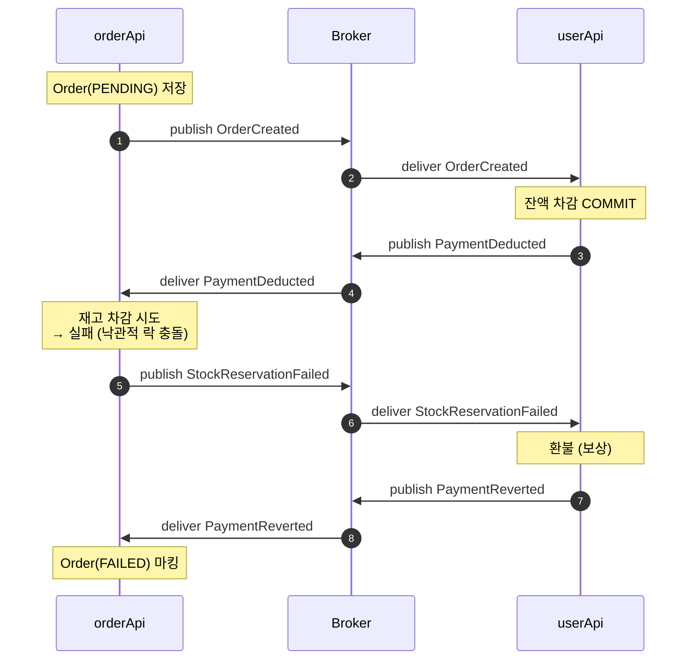
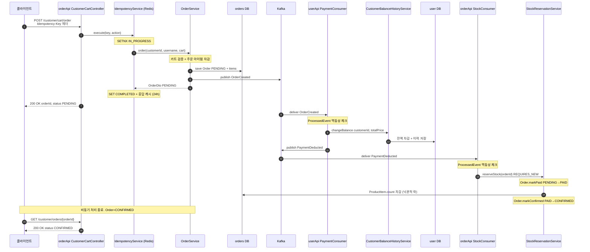
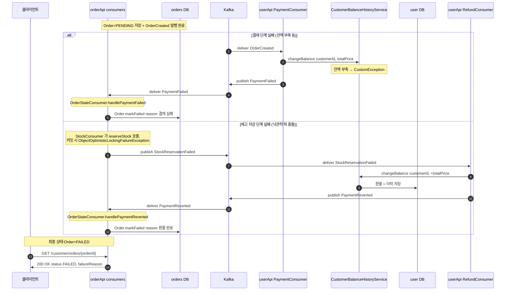
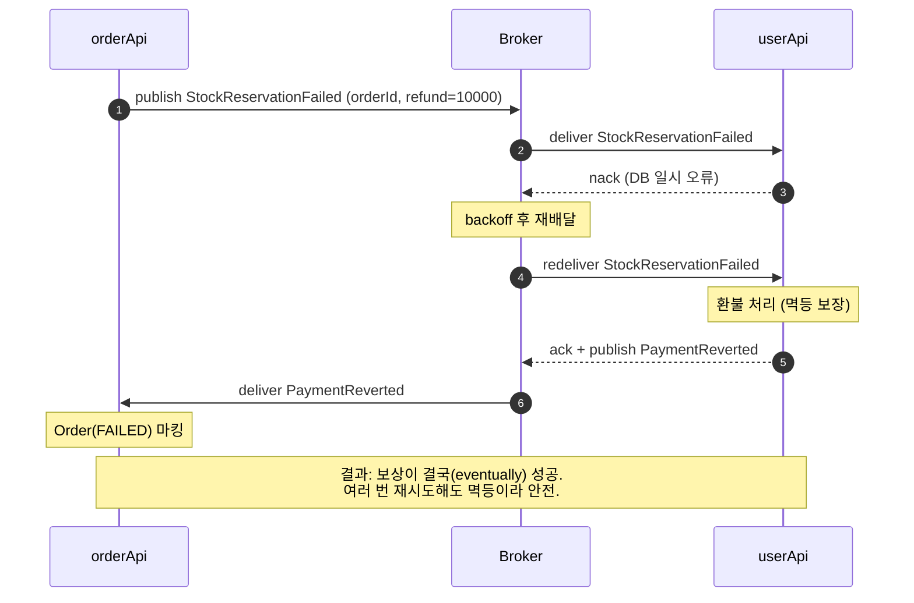
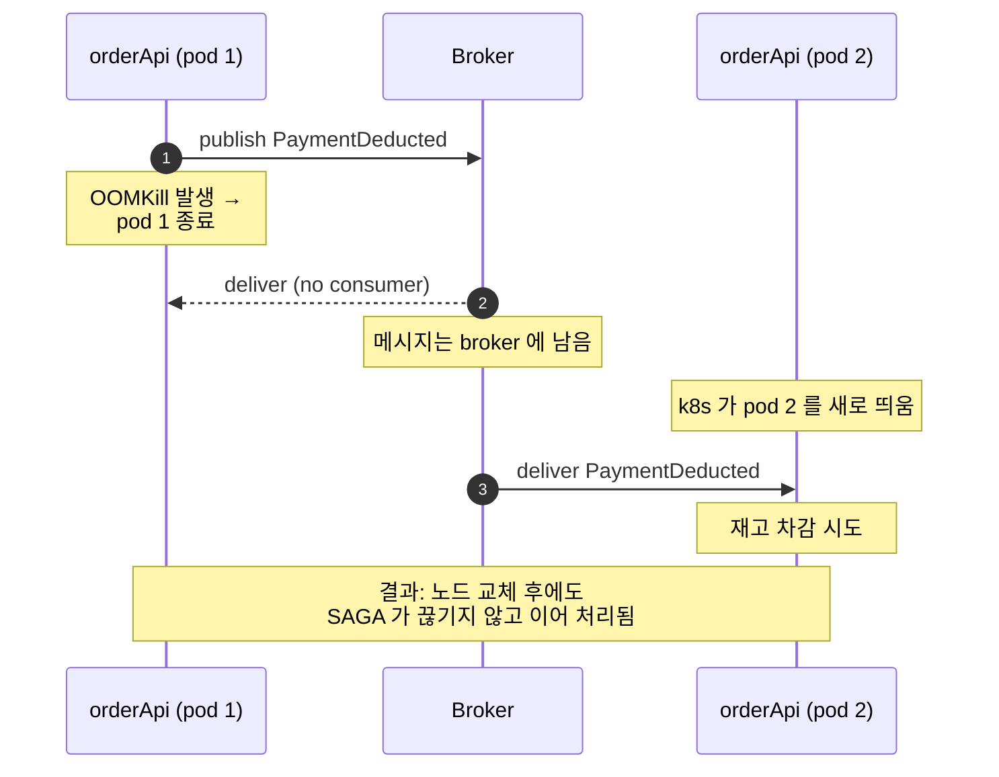

# ADR 003: 결제·재고 분산 트랜잭션 보상에 Choreography SAGA 패턴 적용

- 상태: 제안 (Proposed)
- 작성일: 2026-05-24
- 관련 코드: [orderApi/.../OrderService.java](../orderApi/src/main/java/com/zerobase/orderApi/service/OrderService.java), [orderApi/.../UserClient.java](../orderApi/src/main/java/com/zerobase/orderApi/service/UserClient.java)

## 컨텍스트

ADR-002 적용 이후 주문 흐름은 다음과 같다 ([OrderService.java:90-111](../orderApi/src/main/java/com/zerobase/orderApi/service/OrderService.java#L90-L111)).

```
@Transactional 시작 (orderApi)
   ├─ (1) userClient.changeBalance(-price)  ← userApi 의 별도 트랜잭션에서 즉시 COMMIT
   └─ (2) ProductItem.setCount(...)          ← orderApi 트랜잭션 종료 시 COMMIT 시도
                                                낙관적 락 충돌 시 ROLLBACK
@Transactional 종료
```

문제: (2) 가 `OptimisticLockException` 으로 롤백되어도, **(1) 의 결제는 별도 트랜잭션이라 자동 롤백되지 않는다**. 결과적으로 "결제는 됐는데 주문은 실패" 한 상태가 영구히 남는다. ADR-002 는 이 문제를 "본 ADR 범위 밖" 으로 명시적으로 보류해 두었다.

가장 단순한 보상은 catch 블록에서 환불을 다시 호출하는 **동기 보상** 방식이다.

```java
try {
    userClient.changeBalance(-totalPrice);   // 결제 (커밋됨)
    decrementStock();                         // 재고 차감 → 낙관적 락 충돌 가능
} catch (Exception e) {
    userClient.changeBalance(+totalPrice);    // 동기 보상 (환불)
    throw e;
}
```

본 ADR 은 위 동기 보상 방식의 한계와, **Choreography SAGA 패턴** 의 적용을 다룬다.

## 동기 보상 방식의 문제 시나리오

### 시나리오 1. 보상 호출 자체가 실패

환불(`userClient.changeBalance(+totalPrice)`) 도 네트워크를 타는 원격 호출이다. userApi 가 다운, 5xx, 타임아웃 중 어느 것이든 발생하면 보상이 실패하고, **결제는 됐는데 주문도 없고 환불도 없는** 영구 데이터 불일치가 남는다.



### 시나리오 2. 결제 커밋과 보상 호출 사이에 orderApi 가 죽음



JVM OOM, 컨테이너 OOMKill, deploy 중 SIGTERM, 호스트 장애 — 어느 것이든 보상 코드가 실행되기 전에 발생하면 그대로 손실. **보상이 in-memory catch 블록에 종속되어 있다는 점이 근본 원인**.

### 시나리오 3. 보상 체인이 길어질 때의 복잡도 폭증

주문 흐름이 확장된다고 가정: 결제 → 재고 차감 → 배송 예약 → 쿠폰 사용

- 재고 차감 실패 시 보상: 결제 환불
- 배송 예약 실패 시 보상: 재고 복원 + 결제 환불
- 쿠폰 사용 실패 시 보상: 배송 취소 + 재고 복원 + 결제 환불

N 단계 forward 마다 1...N-1 개의 역순 보상이 필요. 동기 catch 로 처리하면 nested try-catch 가 폭증한다. 게다가 **보상의 보상**(환불 호출이 또 실패하면?) 까지 다루면 코드가 사실상 관리 불능이 된다.

```java
try {
    pay(); 
    try { 
        decrementStock(); 
        try { 
            reserveShipping(); 
            try { useCoupon(); }
            catch (E e) { cancelShipping(); restoreStock(); refund(); }
        } catch (E e) { restoreStock(); refund(); }
    } catch (E e) { refund(); }
} catch (E e) { /* 결제 자체 실패 */ }
```

### 시나리오 4. 보상 latency 가 사용자 응답에 합산

정상 흐름: 결제 80ms + 재고 30ms = **110ms**
실패 흐름: 결제 80ms + 재고 30ms + 환불 호출 80ms = **190ms** (그리고 사용자에게는 5xx)

타임아웃을 짧게 잡은 클라이언트(또는 gateway, ALB) 는 보상이 끝나기 전에 끊고 재시도. 같은 흐름이 다시 트리거되어 **재결제 → 또 재고 실패 → 또 보상** 의 race condition 가능.

---

## 종합 (동기 보상의 한계)

| 시나리오 | 원인 | 결과 |
|---|---|---|
| 1. 보상 호출 실패 | userApi 5xx / 네트워크 | 환불 영구 누락 |
| 2. orderApi crash | OOMKill / SIGTERM | 결제만 됨, 보상 실행 안 됨 |
| 3. 보상 체인 확장 | N 단계 forward → N-1 보상 | nested try-catch 폭증, 보상의 보상 |
| 4. latency 합산 | 동기로 환불을 기다림 | 응답 지연, 클라 재시도 race |

공통 원인: **보상 호출이 in-memory catch 블록에 종속** 되어 있다. 영속화·재시도·순서 보장 같은 안전장치가 전무하므로, 한 번의 호출 실패나 노드 죽음으로 영구히 손실된다.

## 결정 (제안): Choreography SAGA

각 서비스는 자기 단계의 forward 작업이 끝나면 **이벤트를 발행** 하고, 다음 서비스는 그 이벤트를 구독해 진행한다. 어느 단계에서 실패하면 **보상 이벤트** 를 발행해 이전 단계 서비스가 자기 작업을 되돌린다.



핵심 원칙:
- 메시지 브로커(Kafka / RabbitMQ) 가 이벤트를 **영속화 + 재시도 + 순서 보장**.
- 각 서비스는 **자기 단계의 forward + 자기 단계의 보상** 만 정의 (다른 서비스의 보상 코드를 모름).
- 모든 컨슈머는 **멱등성** 보장 (at-least-once delivery 가정 하에 중복 배달이 발생해도 같은 결과로 수렴).
- `Order` 엔티티는 상태 머신 (PENDING → PAID → CONFIRMED / FAILED) 으로 모델링되어 SAGA 의 현재 위치를 추적한다.

### 적용된 코드 흐름 (forward path)

클라이언트 요청부터 결제·재고 확정까지 실제 컴포넌트 단위로 본 흐름.



핵심 포인트:
- **진입 응답은 즉시 PENDING** — 결제·재고가 동기 호출이 아니므로 사용자 응답 latency 가 broker 왕복 시간만큼 짧아진다.
- **두 컨슈머가 모두 멱등** — `ProcessedEvent(eventId, consumerName)` 으로 중복 배달 시 no-op.
- **재고 차감은 별도 트랜잭션** — `StockReservationService.reserveStock()` 이 `REQUIRES_NEW` 라 낙관적 락 충돌(ADR-002)을 호출자(`StockConsumer`)가 catch 해서 `StockReservationFailed` 보상 이벤트로 변환할 수 있다.
- **클라이언트는 `GET /customer/orders/{id}`** 로 최종 상태(CONFIRMED / FAILED) 를 polling. 진입 응답의 `orderId` 가 추적 키.

### 적용된 코드 흐름 (compensation path)

위 forward path 의 결제 단계 또는 재고 차감 단계에서 실패했을 때의 보상 흐름. `Order(PENDING)` 저장과 `OrderCreated` 발행까지는 정상 경로와 동일하므로 그 이후만 표기한다.



핵심 포인트:
- **결제 실패** 는 `OrderCreated` 도착 시점에 바로 분기 → `PaymentFailed` 1회로 종료. userApi 잔액 / 재고 모두 변경 없음.
- **재고 충돌** 은 `Order(PAID)` 까지 갔다가 commit 시 롤백되므로 결제 환불이 필요 → `StockReservationFailed` → `PaymentReverted` 2단계.
- 두 경로 모두 `OrderStateConsumer` 가 `Order.markFailed()` 로 수렴 — 컨슈머 입장에서는 `failureReason` 만 다름.
- 만약 어느 컨슈머 단계가 일시 장애로 실패하면 broker 가 ack 받을 때까지 재배달 → 컨슈머는 `ProcessedEvent` 로 중복 처리 방지.

## Choreography SAGA 도입 후 시나리오

### 시나리오 1'. 보상 이벤트 처리가 실패해도 broker 가 재시도



userApi 환불 컨슈머가 한 번 실패해도 broker 가 ack 를 받지 못해 메시지를 다시 배달한다. exponential backoff 로 재시도하면 일시적 장애(DB 일시 단절, 네트워크 hiccup) 는 결국 성공하게 된다. 보상이 in-memory 한 번의 호출에 묶여 있던 동기 방식과 달리, 메시지는 broker 에 영속화되어 있어 **노드 죽음·재배포에도 손실되지 않는다**.

### 시나리오 2'. 노드가 죽어도 이벤트는 broker 에 남아있음



이벤트가 메시지 broker 에 persisted 되므로, orderApi 가 죽었다가 살아나도 미처리 이벤트를 이어받아 처리. **eventually consistent**.

### 시나리오 3'. 새 단계 추가가 단순

배송 서비스가 추가될 때:

```
PaymentDeducted ─→ orderApi: StockReserved 발행
StockReserved   ─→ shippingApi: ShippingReserved 발행 (또는 ShippingFailed)
ShippingFailed  ─→ orderApi: StockReleased 발행 (자기 보상)
                ─→ userApi: PaymentReverted 발행 (자기 보상)
```

`shippingApi` 는 자기 forward + 자기 보상만 정의하면 끝. orderApi/userApi 코드는 건드릴 필요 없음 — 그저 새 이벤트 타입을 구독·발행하도록 추가만 한다. **체인 확장이 O(1)**.

### 시나리오 4'. 사용자 응답이 빨라짐

orderApi 는 `Order(PENDING)` 생성 + `OrderCreated` 이벤트 발행 후 즉시 **202 Accepted** (또는 주문ID 반환) 응답. 사용자는 polling / webhook / Server-Sent Events 로 최종 상태(SUCCESS / FAILED) 확인. 보상 호출 latency 가 사용자 응답에 합산되지 않는다.

---

## 도입 후 종합

| 시나리오 | 동기 보상 | Choreography SAGA |
|---|---|---|
| 1. 보상 호출 실패 | 환불 영구 누락 | broker 가 ack 받을 때까지 재배달 |
| 2. 노드 crash | 보상 catch 미실행, 영구 불일치 | 이벤트가 broker 에 남아 이어 처리 |
| 3. 보상 체인 확장 | nested try-catch 폭증 | 자기 forward + 자기 보상만 정의 |
| 4. latency 합산 | 환불 시간이 응답에 더해짐 | 202 Accepted 즉시, 비동기 처리 |

남는 책임:
- **메시지 브로커 운영** — Kafka / RabbitMQ 도입 (인프라·운영 비용 추가)
- **모든 컨슈머의 멱등성** — at-least-once delivery 가정에서 중복 처리 방어. 이벤트 ID 단위로 처리 여부를 기록해 재배달 시 no-op 처리.
- **이벤트 스키마 버저닝** — backward-compatible 변경 원칙, 스키마 레지스트리 검토.
- **모니터링** — 재시도가 비정상적으로 누적되는 경우(스키마 mismatch · 버그성 예외 같은 *poison message*) DLQ 도입 검토.
- **사용자 UX 변경** — 동기 200 OK 응답에서 비동기(202 Accepted + 상태 polling/webhook) 로 전환. 클라이언트 측 변경이 동반된다.
- **Choreography 자체의 단점** — 흐름이 여러 서비스에 분산되어 한눈에 추적이 어렵다. 사가 흐름 다이어그램·이벤트 트레이싱(예: OpenTelemetry) 으로 보완 필요.
