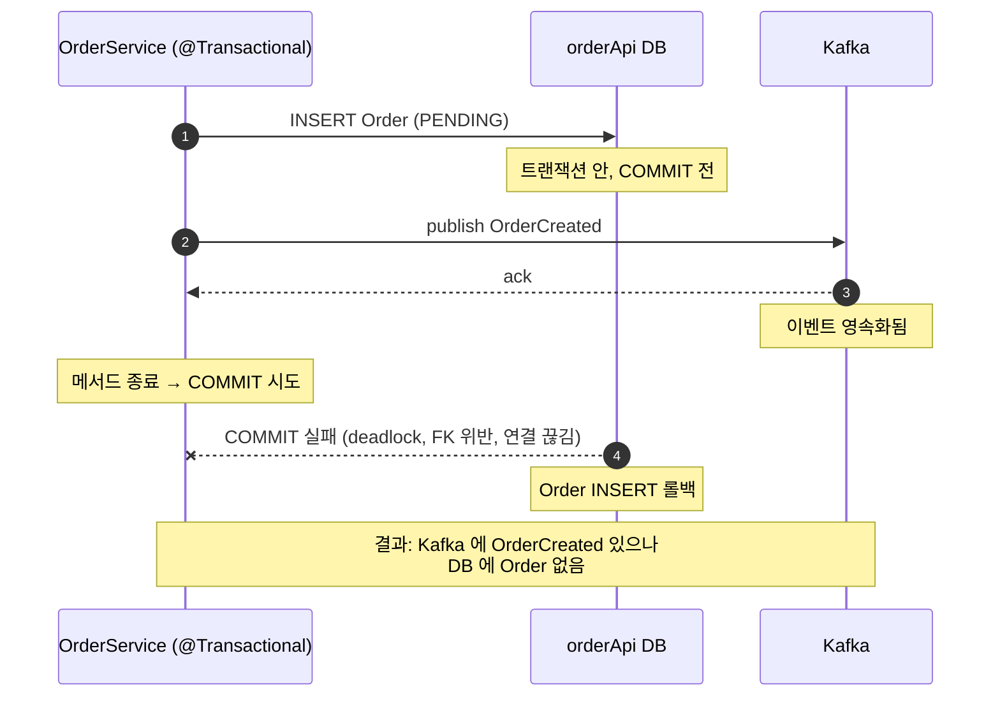
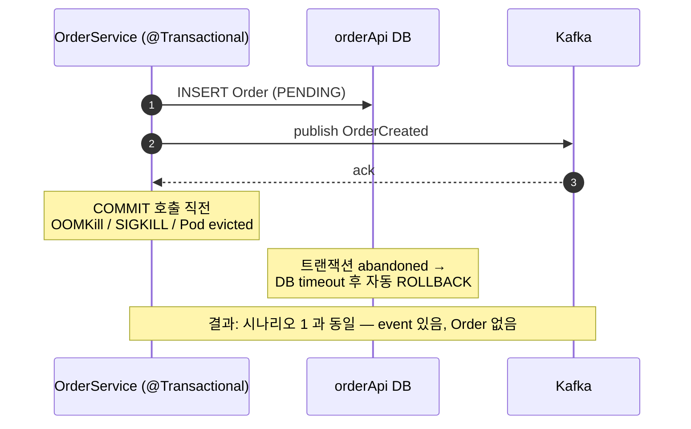
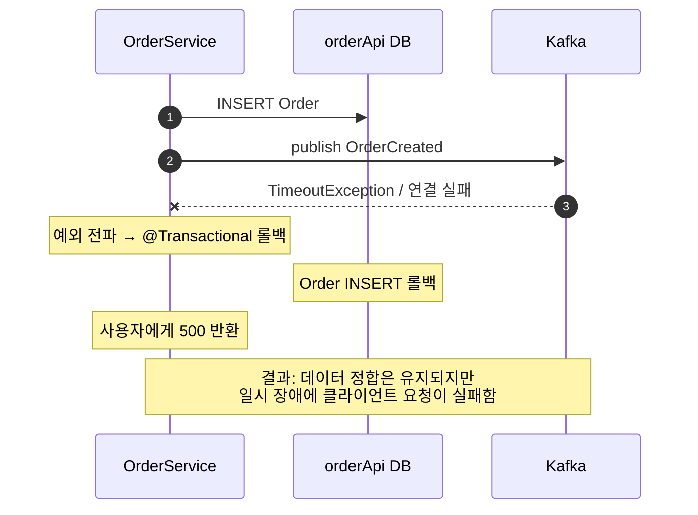
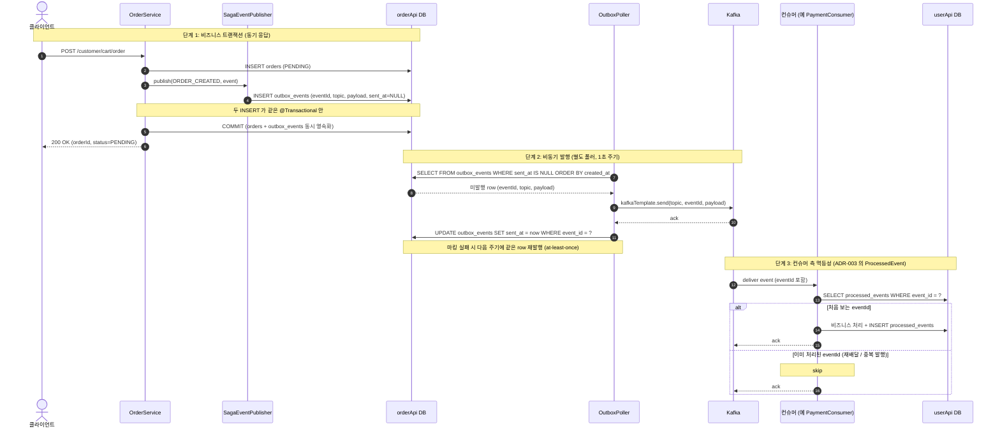
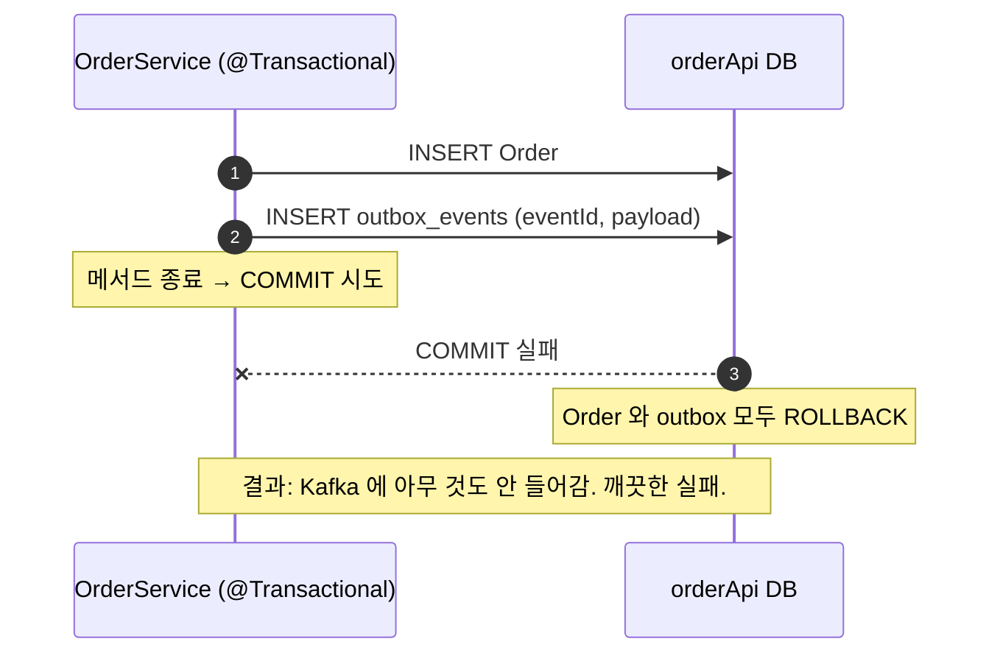
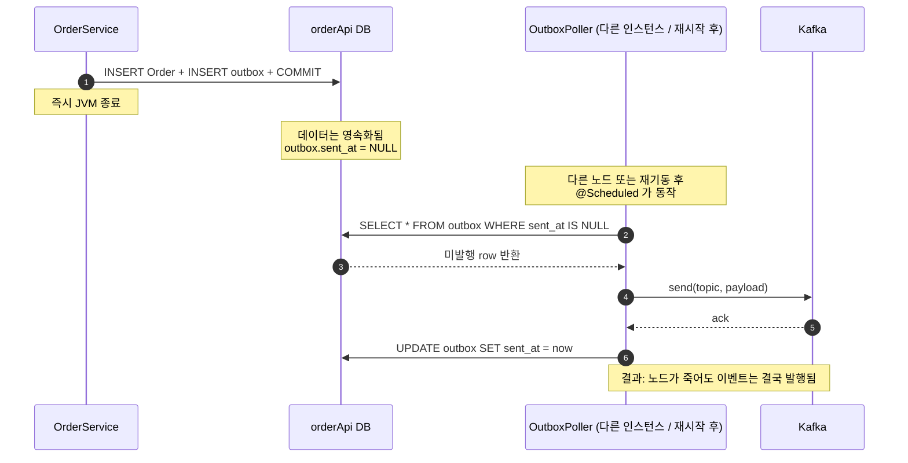
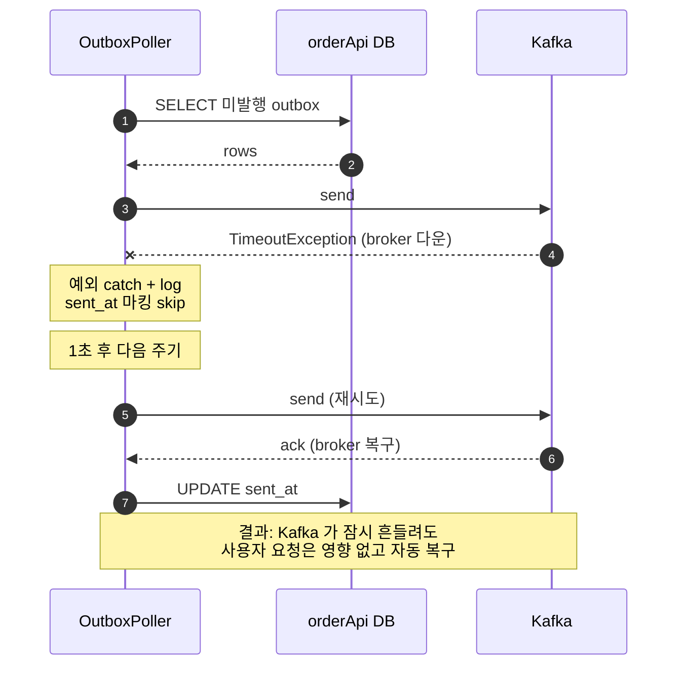
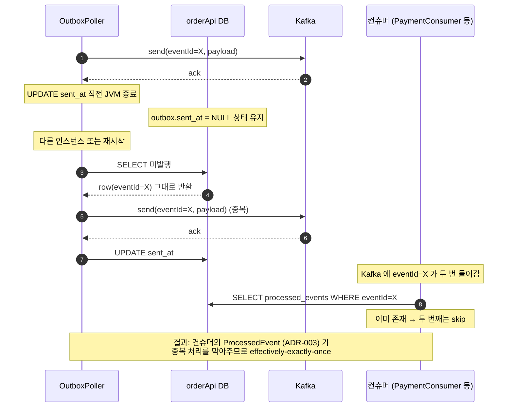

# ADR 004: Kafka 발행에 Transactional Outbox 패턴 적용

- 상태: 제안 (Proposed)
- 작성일: 2026-05-25
- 관련 코드: [orderApi/.../OrderService.java](../orderApi/src/main/java/com/zerobase/orderApi/service/OrderService.java), [orderApi/.../SagaEventPublisher.java](../orderApi/src/main/java/com/zerobase/orderApi/saga/SagaEventPublisher.java)

## 컨텍스트

ADR-003 적용 후 `OrderService.order()` 는 한 메서드 안에서 두 가지 서로 다른 자원(DB, Kafka) 에 쓰기를 수행한다.

```java
@Transactional
public OrderDto order(Long customerId, String username, Cart orderCart) {
    ...
    orderRepository.save(order);                       // (A) JPA INSERT, @Transactional 안
    redisClientService.put(customerId, curCart);       // (B) Redis SET, 트랜잭션 밖
    publisher.publish(SagaTopics.ORDER_CREATED, ...);  // (C) Kafka send, 트랜잭션 밖
    return OrderDto.from(order);
    // @Transactional 종료 시점에 (A) COMMIT
}
```

- (A) 는 JPA 트랜잭션으로 묶이지만, (C) 의 Kafka publish 는 broker 와의 별도 통신이라 같은 트랜잭션에 포함될 수 없다 (Kafka 는 XA 분산 트랜잭션을 일반적으로 쓰지 않음).
- 즉 **DB 에 Order 가 들어가는 것** 과 **Kafka 에 OrderCreated 가 들어가는 것** 이 서로 다른 시점·다른 자원에서 일어난다.
- 이것이 분산 시스템의 고전적 **dual-write problem** 이다.

## 현재 동기 발행 방식의 문제 시나리오

### 시나리오 1. Kafka 발행은 됐는데 DB commit 이 실패



문제점: 컨슈머가 `OrderCreated` 를 받아 처리하려고 `orderRepository.findById()` 를 하면 `ORDER_NOT_FOUND`. broker 가 재배달해도 같은 실패. 결국 poison message 가 된다.

### 시나리오 2. Kafka 발행 후 commit 직전 JVM 종료



문제점: JVM 이 비정상 종료되면 트랜잭션은 결국 롤백되지만 Kafka 발행은 이미 끝난 상태. 시나리오 1 과 같은 결과.

### 시나리오 3. Kafka broker 일시 장애 시 이벤트 유실



문제점: 이벤트 유실은 막혔지만 Kafka 가 잠깐만 흔들려도 사용자 요청이 실패. 비동기 패턴의 장점(브로커 영속화·재시도) 이 사라진다.

## 종합 (현재 한계)

| 시나리오 | 원인 | 결과 |
|---|---|---|
| 1. 발행 후 commit 실패 | DB lock / 네트워크 | event 있음, Order 없음 → poison message |
| 2. 발행 후 JVM 종료 | OOMKill / SIGKILL | 시나리오 1 과 동일 |
| 3. Kafka 일시 장애 | broker 다운 / 네트워크 | 사용자 요청 실패 |

공통 원인: **DB 와 Kafka 가 서로 다른 트랜잭션 자원** 이라 두 쓰기를 원자적으로 묶을 수 없다. Kafka send 의 성공/실패와 DB commit 의 성공/실패가 일관되게 떨어지지 않는다.

## 결정 (제안): Transactional Outbox Pattern

이벤트 발행을 **두 단계로 분리** 한다.

1. **저장 단계** (비즈니스 트랜잭션 안): Kafka 로 보내지 않고, 같은 DB 의 `outbox_events` 테이블에 INSERT. Order INSERT 와 outbox INSERT 가 **하나의 DB 트랜잭션** 으로 묶여 둘 다 commit 되거나 둘 다 롤백된다.
2. **발행 단계** (별도 비동기 프로세스): 주기적으로 `outbox_events` 에서 미발행 row 를 읽어 Kafka 로 발행하고, 성공 시 `sent_at` 마킹.



### 새 테이블

```sql
CREATE TABLE outbox_events (
    event_id      VARCHAR(36)  NOT NULL,
    topic         VARCHAR(100) NOT NULL,
    payload       MEDIUMTEXT   NOT NULL,
    created_at    DATETIME(6)  NOT NULL,
    sent_at       DATETIME(6),
    PRIMARY KEY (event_id),
    INDEX idx_unsent (sent_at, created_at)
) ENGINE = InnoDB;
```

- `event_id`: 발행자가 생성한 UUID. 그대로 페이로드 안의 `eventId` 가 되어 컨슈머의 `ProcessedEvent` 키와 일치 (ADR-003 의 멱등성과 자연스럽게 연결).
- `idx_unsent`: 폴러가 `WHERE sent_at IS NULL ORDER BY created_at` 으로 빠르게 읽기 위함.

## 적용 후 시나리오

### 시나리오 1'. 발행(outbox INSERT) 후 commit 실패 → 같이 롤백



문제 해결: 두 INSERT 가 같은 트랜잭션이라 같이 commit 또는 같이 롤백. **이벤트가 DB 상태와 일관되지 않을 가능성이 0**.

### 시나리오 2'. commit 직후 JVM 종료



문제 해결: outbox row 는 DB 에 안전히 영속화돼 있으므로, 어느 인스턴스든(또는 재시작된 같은 인스턴스든) 폴링 작업이 살아나면 미발행 row 를 읽어 Kafka 로 보낸다. **이벤트 유실 없음**.

### 시나리오 3'. Kafka broker 일시 장애



문제 해결: 발행 실패는 폴러 내부에서 catch 되어 다음 주기에 재시도. **사용자 요청 경로** (`POST /customer/cart/order`) 는 Kafka 상태와 분리되어 항상 빠르게 응답.

### 시나리오 4'. 발행 후 sent 마킹 실패 → 중복 발행



문제 해결: Outbox 는 **at-least-once 발행** 만 보장한다 (중복 발행은 일어날 수 있음). 단, 컨슈머 측에서 ADR-003 의 `ProcessedEvent` 가 같은 `eventId` 의 두 번째 도착을 skip 하므로 **결과적으로 정확히 한 번** 처리된다. Outbox + ProcessedEvent 가 짝을 이루어 end-to-end effectively-exactly-once 를 만든다.

## 도입 후 종합

| 시나리오 | 동기 발행 (현재) | Transactional Outbox |
|---|---|---|
| 1. 발행 후 commit 실패 | event 있음 / Order 없음 → poison | 둘 다 롤백 → 일관된 실패 |
| 2. 발행 후 JVM 종료 | event 있음 / Order 없음 | outbox 가 영속화 → 다른 노드가 발행 |
| 3. Kafka 장애 | 사용자 요청 실패 | 폴러만 영향, 사용자 요청은 정상 |
| 4. 폴러의 sent 마킹 실패 | (없음 — 폴러 미존재) | 중복 발행, 그러나 `ProcessedEvent` 가 흡수 |

요약: **DB commit 의 성공/실패가 곧 이벤트 발행의 성공/실패가 된다**. 두 자원에 걸친 dual-write 가 **한 자원(DB) 의 단일 commit** 으로 환원되어 정합성이 보장된다.

## 남는 책임

- **outbox_events 무한 증가** — sent_at 채워진 row 의 주기적 정리(예: 7일 이상 된 row 삭제) 가 필요. cron 또는 별도 스케줄러로 분리.
- **폴러의 단일성 보장** — 여러 인스턴스가 동시에 폴링하면 중복 발행이 잦아진다 (ProcessedEvent 가 막아주긴 하지만 Kafka 부하 증가). 선택지:
  - 단일 노드에서만 `@Scheduled` 실행 (배포 토폴로지로 보장)
  - 분산 락 (예: Redis Redlock, ShedLock)
  - `SELECT ... FOR UPDATE SKIP LOCKED` 로 DB 락 기반 분배
- **`SagaEventPublisher.publish()` 의 트랜잭션 컨텍스트** — `Propagation.MANDATORY` 로 강제했으므로 호출자가 반드시 `@Transactional` 안이어야 한다. 그렇지 않으면 `IllegalTransactionStateException`. 단위 테스트 작성 시 주의.
