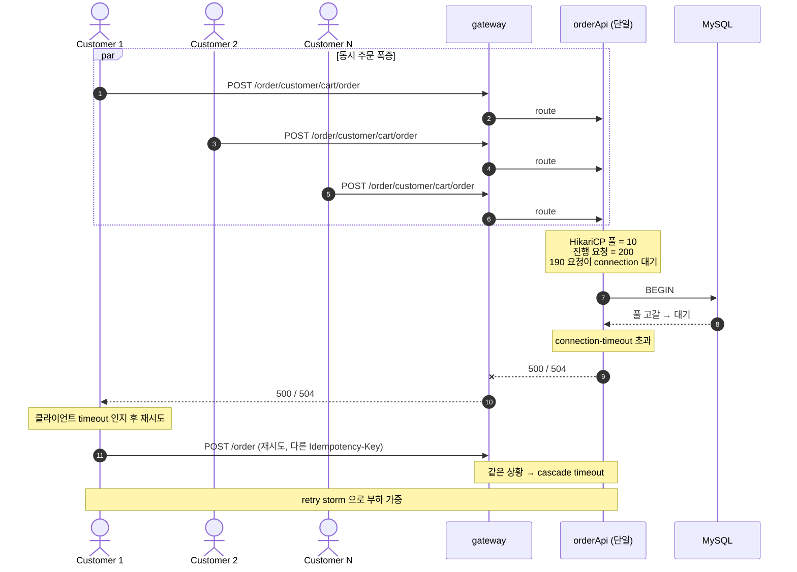
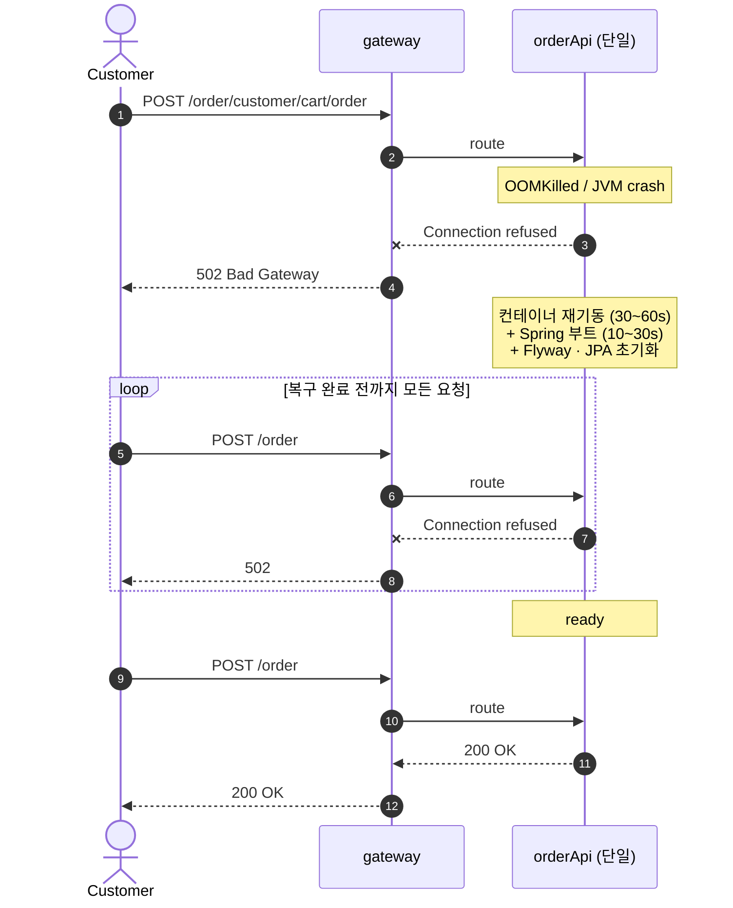
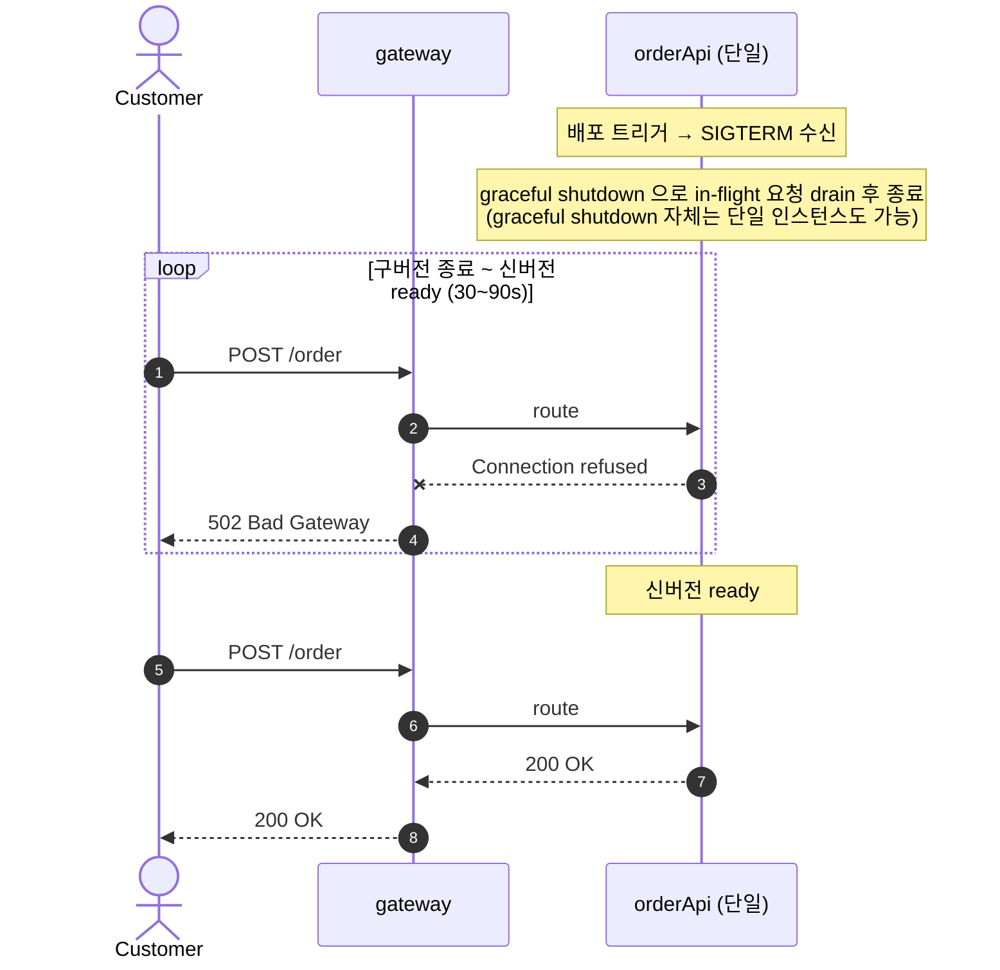
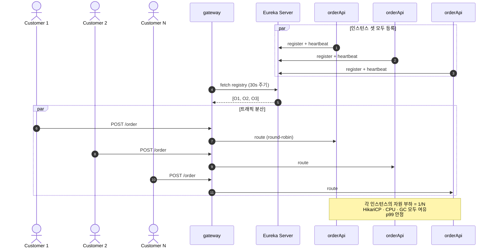
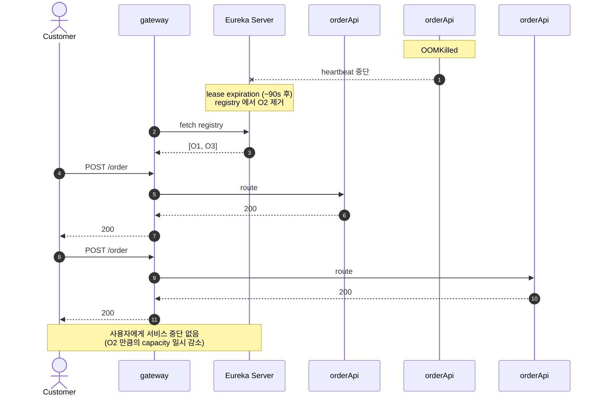
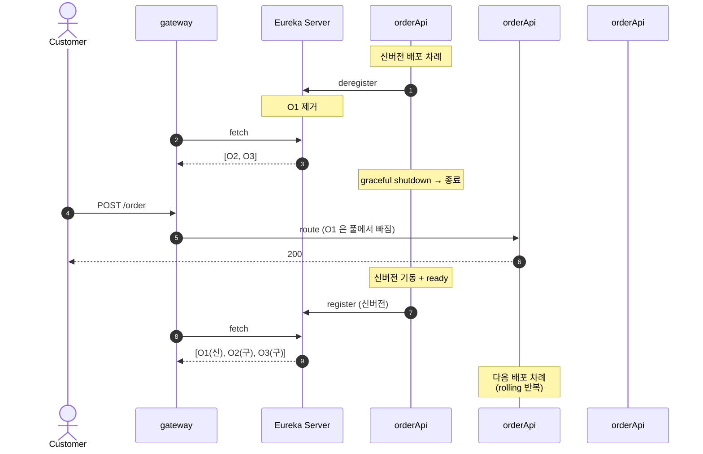

# ADR 005: orderApi 다중 인스턴스 부하 분산을 위한 Eureka + Gateway LoadBalancer 도입

- 상태: 제안 (Proposed)
- 작성일: 2026-05-26
- 관련 코드: [gateway/application.yml](../gateway/src/main/resources/application.yml), [CustomerCartController.java](../orderApi/src/main/java/com/zerobase/orderApi/controller/CustomerCartController.java)

## 컨텍스트

현재 gateway 는 백엔드 주소를 application.yml 에 하드코딩한다 ([application.yml:9-15](../gateway/src/main/resources/application.yml#L9-L15)).

```yaml
spring:
  cloud:
    gateway:
      routes:
      - id: order-api
        uri: http://ip-172-31-14-142.ap-northeast-2.compute.internal:8080
        predicates:
        - Path=/order/**
```

orderApi · userApi 는 각 1 인스턴스로 운영된다. ADR-003 (Choreography SAGA) 과 ADR-004 (Transactional Outbox) 적용 후 orderApi 는 **stateless** 가 되어 (Cart 는 Redis, 이벤트는 outbox table) 인스턴스 추가만으로 수평 확장이 안전한 상태다. 그러나 gateway 가 단일 백엔드 주소를 갖고 있어 다중화의 이점을 활용하지 못한다.

본 ADR 은 단일 인스턴스 + 하드코딩 라우팅 방식의 운영 한계를 정리하고, Eureka + Spring Cloud Gateway LoadBalancer 도입을 제안한다.

## 현재 방식의 문제 시나리오

### 시나리오 1. 트래픽 급증 시 단일 인스턴스 자원 천장 도달

특정 시간대 (점심·세일 오픈 등) 에 동시 주문이 몰리면 단일 orderApi 의 HikariCP 풀 · CPU · GC 가 한계에 도달한다.



문제점: 한 인스턴스의 자원이 천장에 닿으면 p99 latency 가 폭증해 client timeout 이 발생. 클라이언트가 동일한 Idempotency-Key 를 붙이지 않은 채 재시도하면 중복 주문 위험까지. 단일 인스턴스인 이상 수평 확장으로 흡수할 경로가 없다.

### 시나리오 2. 인스턴스 장애로 전체 서비스 중단

OOM kill, JVM crash, OS reboot, deploy 중 SIGTERM 등 어느 이유로든 단일 orderApi 가 죽으면 gateway 의 백엔드가 사라진다.



문제점: gateway 가 단일 백엔드 주소를 갖고 있어 fallback 이 없다. 인스턴스 부팅 동안 (보통 1~3 분) 주문 0 건. **단일 점 (single point of failure)** 이 전체 매출에 직접 영향. 운영자가 즉시 알아채야 함.

### 시나리오 3. 배포 시 다운타임

신버전 배포는 단일 인스턴스를 종료하고 새 인스턴스를 띄우는 방식이라 무중단 배포 불가. 인스턴스가 1 개뿐이므로 종료 ~ 신버전 ready 사이의 신규 요청을 받을 곳이 없다.



문제점: 인스턴스가 1 개라 배포 중 신규 요청을 받을 인스턴스가 없다. graceful shutdown 으로 진행 중 요청은 안전하게 마무리되지만, **새로 들어오는 사용자는 30~90 초간 모두 502**. 배포 빈도가 높을수록 누적 다운타임이 매출에 직접 영향.

---

## 종합 (현재 한계)

| 시나리오 | 원인 | 결과 |
|---|---|---|
| 1. 트래픽 폭증 | 단일 인스턴스 자원 한계 | p99 폭증, retry storm, 중복 주문 위험 |
| 2. 인스턴스 장애 | gateway 가 단일 백엔드만 앎 | 부팅 완료까지 전체 서비스 중단 |
| 3. 배포 다운타임 | 인스턴스 1 개, fallback 없음 | 배포 중 신규 요청 모두 502 |

공통 원인: **gateway 가 백엔드 인스턴스의 동적 토폴로지를 인지하지 못한다**. 인스턴스 추가 / 제거 / 장애가 일어나도 gateway 는 모르고, 사람이 yml 을 고쳐야 안다.

## 결정 (제안): Eureka Server + Spring Cloud Gateway LoadBalancer

- 각 orderApi 인스턴스는 기동 시 **Eureka Server** 에 자신의 (service-id, host, port) 를 등록하고 30 초마다 heartbeat 전송. 종료 시 deregister.
- gateway 는 정적 uri 대신 `lb://order-api` 형태의 logical service id 로 라우팅 정의. 내부적으로 Eureka registry 를 fetch 해 인스턴스 목록을 캐시하고 round-robin (또는 weighted) LB 로 분배.
- 인스턴스 추가 / 제거는 등록 / 해제만으로 즉시 반영. gateway 재빌드 / 재배포 불필요.

```yaml
spring:
  cloud:
    gateway:
      routes:
      - id: order-api
        uri: lb://order-api   # ← 하드코딩 주소 → Eureka service-id
        predicates:
        - Path=/order/**
```

## 도입 후 시나리오

### 시나리오 1'. 트래픽 분산으로 자원 천장 우회



문제 해결: 인스턴스를 N 개로 늘리면 동일 트래픽이 1/N 로 분산. HikariCP · CPU 천장이 멀어져 p99 안정. retry storm 없음.

### 시나리오 2'. 인스턴스 장애 자동 우회



문제 해결: gateway 가 등록된 모든 인스턴스를 알고 있으므로 일부가 죽어도 나머지로 라우팅. lease expiration 까지 (~90 초) 일부 요청이 죽은 인스턴스로 갈 수 있으나, Spring Cloud LB 의 retry 정책으로 다음 인스턴스로 재시도 가능.

### 시나리오 3'. 무중단 rolling 배포



문제 해결: 인스턴스를 1 개씩 deregister → 종료 → 신버전 기동 → register 순으로 교체. 항상 N-1 개가 트래픽을 받으므로 **신규 요청 다운타임 0**. 각 인스턴스의 graceful shutdown 은 이전과 동일하게 적용되어 in-flight 요청도 정상 마무리.

---

## 도입 후 종합

| 시나리오 | 단일 인스턴스 + 하드코딩 | Eureka + LB |
|---|---|---|
| 1. 트래픽 폭증 | 자원 천장, retry storm | 1/N 분산, 자원 여유 |
| 2. 인스턴스 장애 | 전체 서비스 중단 | 자동 우회, 무중단 |
| 3. 배포 다운타임 | 배포 중 신규 요청 모두 502 | rolling 무중단 |

요약: **백엔드 토폴로지의 동적 변화를 gateway 가 인지** 하게 되어, 인스턴스의 추가 / 제거 / 장애가 사용자 경험과 운영 작업에서 분리된다.

## 남는 책임

- **다인스턴스 시 OutboxPoller 중복 발행** — 모든 orderApi 인스턴스에서 `@Scheduled` polling 이 동시 실행되어 같은 row 가 N 회 발행될 수 있다. ProcessedEvent 가 컨슈머 단에서 흡수하지만 Kafka 부하 증가. 분산 락 (Redis Redlock, ShedLock) 또는 `SELECT ... FOR UPDATE SKIP LOCKED` 도입은 별도 ADR.
- **Eureka Server 가용성** — Eureka Server 가 단일이면 등록 · 발견이 막힌다. 운영 시 Eureka 클러스터 구성 또는 client-side cache 신뢰 정책 (`registry-fetch-interval-seconds`, `eureka.instance.lease-renewal-interval-in-seconds` 튜닝) 필요.
- **lease expiration 동안의 stale routing** — 인스턴스가 죽은 직후 Eureka 가 만료시키기까지 (~90 초) gateway 가 죽은 인스턴스로 라우팅할 수 있음. Spring Cloud LB 의 retry · circuit breaker · health check 설정으로 사용자 영향 최소화 필요.
