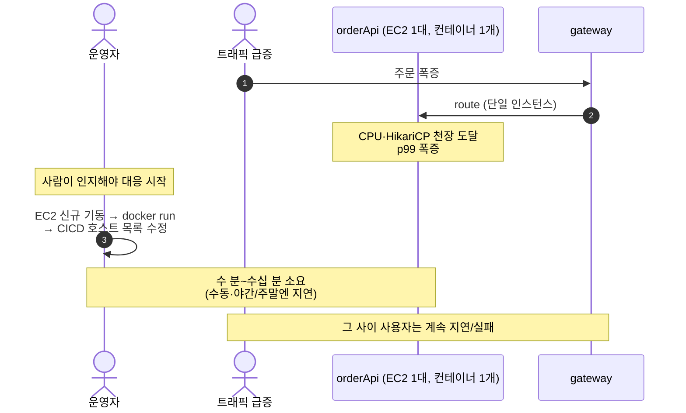
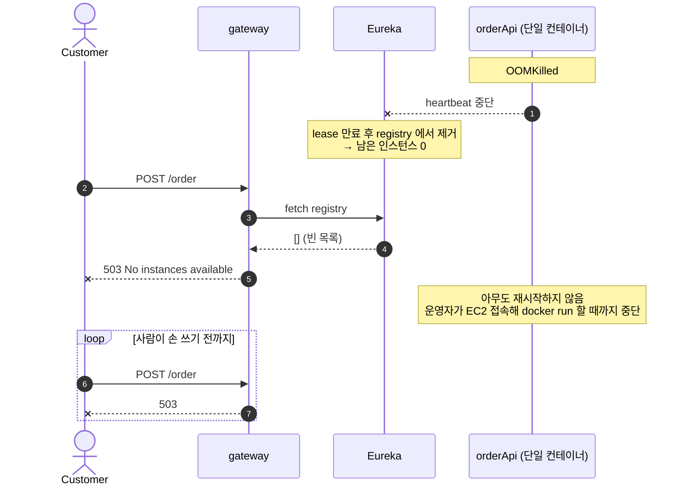
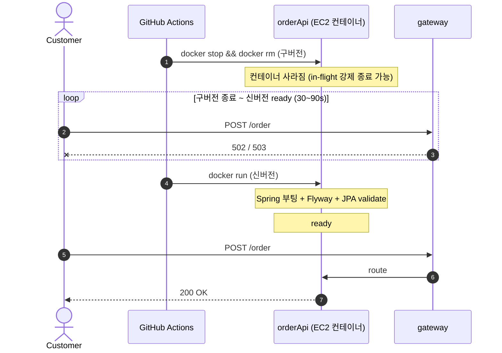
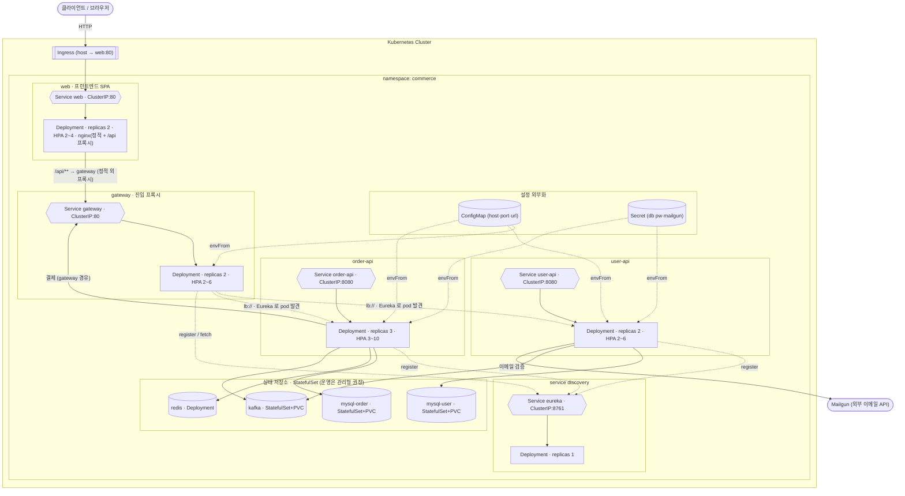
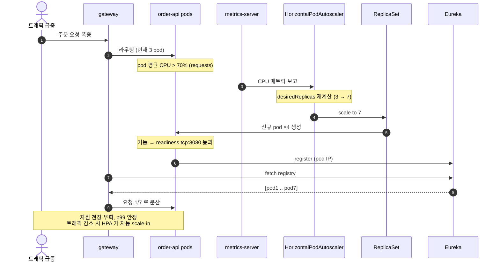
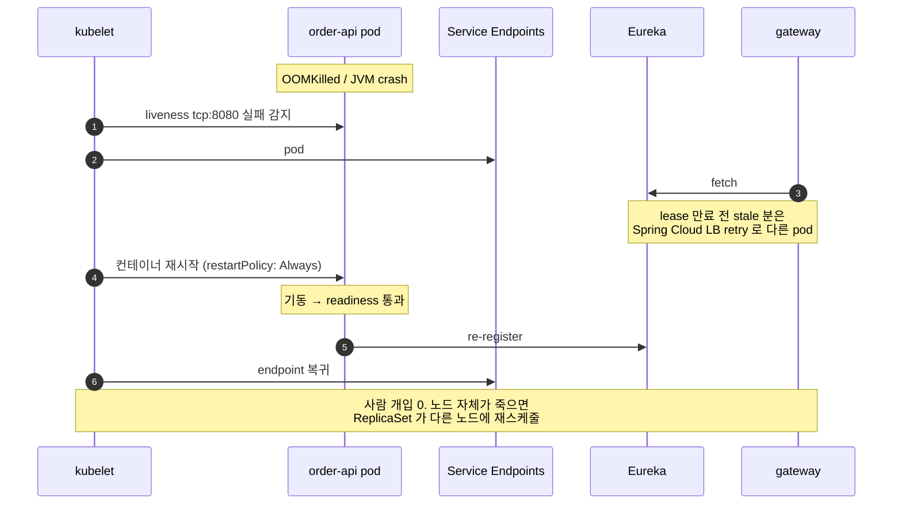
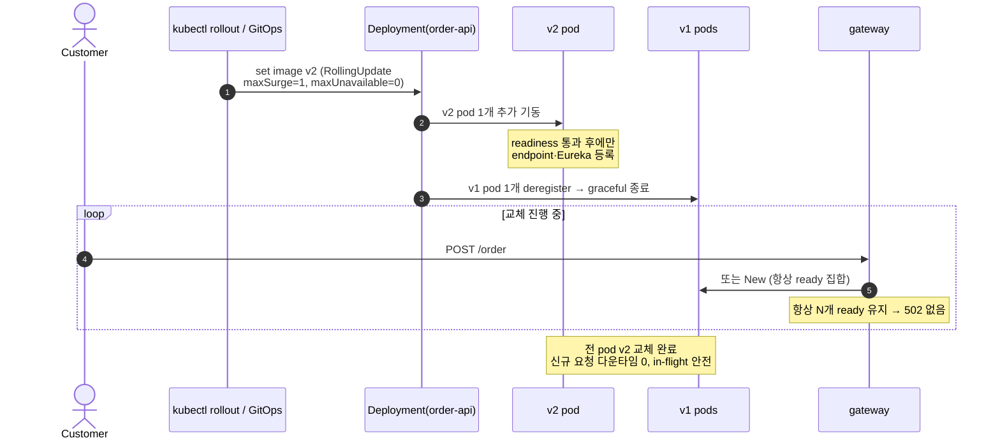

# ADR 006: 확장성 확보를 위한 Kubernetes 백엔드 배포 도입

- 상태: 제안 (Proposed)
- 작성일: 2026-06-01
- 관련 코드: [.github/workflows/CICD.yml](../.github/workflows/CICD.yml), [docker-compose.test.yml](../docker-compose.test.yml), [qa/docker-compose.qa.yml](../qa/docker-compose.qa.yml), [k8s/](../k8s/)

## 컨텍스트

현재 배포는 CI 가 이미지 3개(gateway · userApi · orderApi)를 ECR 에 push 한 뒤, **EC2 호스트 3대에 SSH 로 접속해 `docker stop && docker rm && docker run` 으로 컨테이너를 1개씩** 띄우는 방식이다 ([CICD.yml:88-143](../.github/workflows/CICD.yml#L88-L143)).

```bash
# 각 EC2 에서 실행되는 배포 스크립트의 핵심
sudo docker stop commerce-orderapi || true
sudo docker rm   commerce-orderapi || true
sudo docker pull $ECR_REGISTRY/commerce-orderapi:latest
sudo docker run -d --name commerce-orderapi -p 8080:8080 $ECR_REGISTRY/commerce-orderapi:latest
```

[ADR-005](./005-eureka-gateway-load-balancing.md) 에서 Eureka + Gateway LoadBalancer 를 도입해 **gateway 가 백엔드 인스턴스 토폴로지를 동적으로 인지**하도록 만들었다. 즉 orderApi 를 N 개로 늘리면 트래픽이 1/N 로 분산되는 *경로* 는 마련됐다.

그러나 **인스턴스를 실제로 N 개로 늘리고 · 줄이고 · 죽으면 되살리고 · 무중단으로 교체할 오케스트레이터가 없다.** `docker run` 은 호스트당 컨테이너 1개를 띄울 뿐이며, 스케일·자가 치유·롤링 배포는 사람이 스크립트를 고쳐 수행해야 한다. ADR-005 가 깐 LB 의 이점("도입 후 시나리오")은 **그 인스턴스들을 누가 관리하느냐** 라는 운영 계층이 빠져 있으면 현실에서 실현되지 않는다.

본 ADR 은 EC2 단일 `docker run` 배포의 한계를 정리하고, **Kubernetes 전환** 과 그때 리소스가 어떻게 배치·사용되는지를 제안한다.

## 현재 방식의 문제 시나리오

### 시나리오 1. 수평 확장이 수동 — LB 는 있는데 늘릴 손이 없다

ADR-005 로 `lb://order-api` 라우팅은 준비됐지만, 인스턴스를 추가하려면 EC2 를 새로 띄우고 docker run 을 다시 치고 CICD 스크립트의 호스트 목록을 고쳐야 한다.



문제점: LB 가 있어도 **인스턴스를 자동으로 늘리는 주체가 없다.** 확장은 사람의 반응 속도에 묶이고, 트래픽이 빠질 때 다시 줄이는 것도 수동이라 자원이 낭비된다.

### 시나리오 2. 자가 치유 부재 — 컨테이너가 죽으면 방치된다

`docker run` 으로 띄운 컨테이너가 OOMKilled / JVM crash 로 죽으면, 그것을 되살릴 감시자가 없다(`--restart` 정책조차 스크립트에 없다). ADR-005 시나리오 2'(장애 자동 우회)는 *다른 인스턴스가 살아있다* 는 전제인데, 인스턴스가 1개뿐이라 전제가 성립하지 않는다.



문제점: 단일 점(SPOF). 컨테이너 사망 = 서비스 중단이며, 복구가 **사람의 수동 개입** 에 의존한다.

### 시나리오 3. 배포 다운타임 — stop → rm → run 사이의 공백

배포는 구버전을 `stop && rm` 한 뒤 신버전을 `run` 한다. 인스턴스가 1개뿐이라 그 사이 신규 요청을 받을 곳이 없다. ADR-005 시나리오 3'(rolling 무중단)도 *교체 중 N-1 개가 트래픽을 받는다* 는 전제인데, 오케스트레이터가 없어 한 번에 1개를 통째로 내렸다 올린다.



문제점: 배포마다 30~90 초 다운타임 + in-flight 요청 유실 위험. 배포 빈도가 높을수록 누적 다운타임이 매출에 직접 영향.

---

## 종합 (현재 한계)

| 시나리오 | 원인 | 결과 |
|---|---|---|
| 1. 수평 확장 수동 | 인스턴스를 늘릴 오케스트레이터 없음 | 확장이 사람 반응 속도에 묶임, 축소도 수동 |
| 2. 자가 치유 부재 | 컨테이너 감시자/재시작 정책 없음 | 사망 = 중단, 수동 복구 의존 |
| 3. 배포 다운타임 | 한 번에 1개를 stop→run | 배포마다 30~90s 502, in-flight 유실 |

공통 원인: **ADR-005 가 마련한 "다중 인스턴스 LB" 의 이점을 실현할 운영 계층(스케줄링·헬스 관리·롤링)이 없다.** `docker run` 은 컨테이너 1개를 띄우는 명령일 뿐, 워크로드를 *관리* 하지 않는다.

## 결정 (제안): Kubernetes 로 전환

각 백엔드 서비스를 Kubernetes 오브젝트로 선언적 배포한다. 핵심 매핑:

| 운영 요구 | Kubernetes 메커니즘 |
|---|---|
| 수평 확장 — Pod 층 | `Deployment.replicas` + `HorizontalPodAutoscaler` (CPU 기준) — 모든 k8s 공통 |
| 수평 확장 — Node 층 | prod/EKS: Cluster Autoscaler / Karpenter (Pending pod → EC2 노드 자동 증감) · test/로컬: 단일 노드 |
| 자가 치유 | ReplicaSet 가 목표 replicas 유지 + `livenessProbe` 로 재시작 + 노드 장애 시 재스케줄 |
| 무중단 배포 | `RollingUpdate` (maxSurge / maxUnavailable) + `readinessProbe` gate |
| 안정적 네트워크 ID | `Service` (ClusterIP) + 클러스터 DNS |
| 외부 진입 | `Ingress` (→ web:80) · web nginx 가 SPA 서빙 + `/api/**`→gateway 프록시 |
| 설정 외부화 | `ConfigMap` (host·port·url) + `Secret` (db pw·mailgun) |
| 상태 저장소 | `StatefulSet` + `PVC` (또는 운영 시 RDS/ElastiCache/MSK 관리형) |
| 자원 격리 | pod 별 `requests` / `limits` |

Eureka(ADR-005)는 **그대로 유지** 한다. **Java 코드는 변경하지 않고** 오케스트레이션 계층을 EC2 → k8s 로 교체한다. 단 운영 안전과 명명 일관성을 위해 userApi·orderApi 에 운영용 `application-prod.yml`(env 외부화 + 운영 설정)을 추가한다 — 아래 *배포 형상* 참고. (Eureka 와 k8s 네이티브 디스커버리의 중복은 *남는 책임* 참고.)

### 배포 형상 — test(로컬 k8s) / prod(EKS)

배포 대상은 둘이다. 동일한 base 매니페스트를 **kustomize overlay** 로 환경별 패치한다.

| 항목 | test — 로컬 k8s (minikube/kind/Docker Desktop) | prod — EKS |
|---|---|---|
| Node 층 | 노트북 단일 노드 (노드 오토스케일 없음) | Managed Node Group + Cluster Autoscaler / Karpenter |
| 상태 저장소 | **in-cluster StatefulSet** (MySQL ×2 · Redis · Kafka) | **관리형** RDS · ElastiCache · MSK |
| 외부 진입 | **nginx Ingress** (ingress-nginx + cloud-provider-kind) / `port-forward` 폴백 | **ALB Ingress** (AWS Load Balancer Controller) |
| 이미지 | 로컬 빌드 → kind/minikube load, `IfNotPresent` | ECR, `Always` |
| replicas / HPA | 1~2 고정, HPA 생략 | HPA gateway 2~6 · user-api 2~6 · order-api 3~10 |
| Secret | 로컬 더미 (commerce/commerce) | 실제 (External Secrets / SSM) |
| **`SPRING_PROFILES_ACTIVE`** | **`test`** (`application-test.yml`) | **`prod`** (`application-prod.yml`) |

`test` overlay 는 [docker-compose.test.yml](../docker-compose.test.yml) 의 쿠버네티스 판이다 (같은 `test` 프로파일·in-cluster 의존·더미 자격증명).

디렉터리 구조 (kustomize base + overlays):

```
k8s/
├── base/                        # 공통(앱) — 플랫폼 중립
│   └── namespace · configmap(공통 키) · eureka · gateway · user-api · order-api · web(SPA)
└── overlays/
    ├── test/                    # 로컬 k8s · SPRING_PROFILES_ACTIVE=test
    │   ├── infra/               # mysql-user · mysql-order · redis · kafka (StatefulSet)
    │   ├── configmap-test.yaml  # host = 클러스터 내 svc 이름
    │   ├── secret-test.yaml     # 더미 자격증명
    │   ├── ingress-nginx.yaml   # 외부 진입 Ingress (ingressClassName: nginx)
    │   └── patches              # replicas=1 · 축소 resources
    └── prod/                    # EKS · SPRING_PROFILES_ACTIVE=prod
        ├── configmap-prod.yaml  # host = RDS / ElastiCache / MSK 엔드포인트
        ├── secret-prod.yaml     # placeholder (실제는 External Secrets)
        ├── hpa.yaml · ingress-alb.yaml
        └── patches              # 운영 resources/replicas · ECR images
```

적용: `kubectl apply -k k8s/overlays/test` · `kubectl apply -k k8s/overlays/prod`

**overlay 이름과 Spring 프로파일을 일치시킨다.** overlay(`test`/`prod`)는 *k8s 타깃 환경* 을, `SPRING_PROFILES_ACTIVE` 는 *앱 설정 출처* 를 가리키는 다른 축이다. 둘을 맞추기 위해 **userApi·orderApi 에 `application-prod.yml` 을 신규 추가**한다 — `application-test.yml` 과 동일한 `${ENV}` placeholder 를 쓰되 운영 설정으로 바꾼다.

| 설정 | `application-test.yml` | `application-prod.yml` (신규) |
|---|---|---|
| datasource / redis / user-api.url | `${ENV}` placeholder | 동일 `${ENV}` placeholder |
| `spring.flyway.clean-disabled` | `false` (clean 허용) | `true` (clean 금지) |
| `spring.jpa.show-sql` | `true` | `false` |
| 로깅 (`com.zerobase.*` 등) | DEBUG | INFO |

이로써 EKS 배포가 더 이상 `test` 프로파일을 빌려 쓰지 않는다. gateway·eureka 는 base `application.yml` 자체가 운영 적합(env 기반 eureka URL·INFO 로깅)이라 prod 프로파일 없이 base 를 쓴다. **Java 코드는 변경하지 않으며 추가되는 것은 yml 두 개뿐이고, 기존 테스트/CI 는 prod 프로파일을 활성화하지 않아 영향이 없다.**

## 아키텍처 그림 — 클러스터 내 리소스 배치



흐름 요약:

1. 외부 트래픽은 **Ingress → web Service → web pod(nginx)** 로 들어온다. web 은 정적 SPA 를 서빙하고, `/api/**` 요청만 `/api` 를 떼어 **gateway Service** 로 프록시한다(`apps/web/nginx.conf`). gateway 는 외부에 직접 노출되지 않는 내부 ClusterIP 이며, Ingress 는 `/ → web` 단일 백엔드라 nginx/ALB 모두 경로 rewrite 가 필요 없다.
2. gateway 는 `lb://user-api` · `lb://order-api` 라우팅을 **Eureka 레지스트리에서 발견한 pod IP** 로 직접 분배한다(`prefer-ip-address: true`). 즉 user-api / order-api 의 ClusterIP Service 는 gateway 라우팅의 *필수 경로는 아니며*, 비-Eureka 접근·디버깅·향후 k8s 네이티브 디스커버리 전환을 위한 안정 ID 로 함께 둔다.
3. order-api 의 결제 호출은 `http://gateway/user/customer` 로 **gateway 를 경유**(ADR-005 의 compose 계약과 동일)한다.
4. 모든 앱 pod 은 `ConfigMap`(비밀 아닌 host·port·url) 과 `Secret`(db 비밀번호·mailgun 키)을 `envFrom` 으로 주입받는다 — `application-test.yml` 의 env-var 계약을 그대로 사용.
5. 상태 저장소(MySQL ×2 · Redis · Kafka)는 자기완결 클러스터를 위해 StatefulSet 으로 제공하되, 운영에서는 RDS / ElastiCache / MSK 로 교체하고 ConfigMap 의 host 만 바꾼다.

> 이 그림은 전체 논리 토폴로지다. infra 블록(StatefulSet)은 **test(로컬)** 형상이며, **prod(EKS)** 는 이를 관리형 RDS/ElastiCache/MSK 로 빼고 Ingress 컨트롤러를 ingress-nginx → ALB 로 바꾼다. replicas/HPA 주석은 **prod 기준** (test 는 replicas=1·HPA 생략) — 위 *배포 형상* 참조.

## 리소스 사용 계획

### 워크로드별 replicas · requests · limits

| 서비스 | 워크로드 | replicas (HPA) | requests (cpu / mem) | limits (cpu / mem) | 비고 |
|---|---|---|---|---|---|
| web | Deployment | 2 (2~4) | 50m / 64Mi | 200m / 128Mi | 외부 진입 · nginx 정적 SPA + `/api`→gateway 프록시 |
| gateway | Deployment | 2 (2~6) | 250m / 512Mi | 1 / 768Mi | 내부 진입 프록시, reactive(Netty) |
| eureka | Deployment | 1 | 250m / 256Mi | 500m / 512Mi | 레지스트리(단일, 아래 *남는 책임*) |
| user-api | Deployment | 2 (2~6) | 500m / 512Mi | 1 / 1Gi | JWT 발급·결제 원장 |
| order-api | Deployment | 3 (3~10) | 500m / 512Mi | 1 / 1Gi | 핫패스(주문) — 최다 replicas |
| mysql-user | StatefulSet | 1 | 250m / 512Mi | 1 / 1Gi | PVC 10Gi · test 전용 · 운영: RDS |
| mysql-order | StatefulSet | 1 | 250m / 512Mi | 1 / 1Gi | PVC 10Gi · test 전용 · 운영: RDS |
| redis | Deployment | 1 | 100m / 128Mi | 250m / 256Mi | test 전용 · 캐시/장바구니 · 운영: ElastiCache |
| kafka | StatefulSet | 1 | 250m / 512Mi | 1 / 1Gi | PVC 5Gi · KRaft · test 전용 · 운영: MSK |

- **형상별 차이**: 앱(gateway·eureka·user-api·order-api) 행은 **prod(EKS)** 기준이며, **test(로컬)** overlay 는 replicas=1 · HPA 생략으로 패치한다. infra(mysql·redis·kafka) 행은 **test 전용 in-cluster** 값이다 (prod 는 관리형이라 이 매니페스트에 StatefulSet 자체가 없음).
- **JVM heap**: JRE 17 컨테이너 기본 `MaxRAMPercentage` 가 25% 라 1Gi limit 에서 heap 이 ~256Mi 로 과소 할당된다. 각 앱 pod 에 `JAVA_TOOL_OPTIONS=-XX:MaxRAMPercentage=70.0` 을 주입해 limit 의 70% 를 heap 으로 쓰게 한다(Dockerfile 변경 없이 env 로).
- **HPA**: 목표 CPU 사용률 70%(requests 기준). 예) order-api requests 500m → pod 평균 350m 초과 시 scale-out. metrics-server 필요(*남는 책임*).
- ADR-005 는 측정을 위해 **userApi 를 단일 인스턴스 고정 변수** 로 두었으나, 그것은 LB 효과 측정용 제약이었다. 운영 배포에서는 user-api 도 HA 를 위해 다중화(replicas 2 + HPA)한다.

### 헬스 체크 (probe) — Actuator 미도입 상태 기준

현재 어떤 모듈도 `spring-boot-starter-actuator` 를 포함하지 않아 `/actuator/health` 가 없다. 코드 변경 0 을 위해 다음과 같이 의존성 없는 probe 를 사용한다.

| 서비스 | readiness | liveness |
|---|---|---|
| web | httpGet `/` :80 | httpGet `/` :80 |
| eureka | httpGet `/` :8761 | tcpSocket :8761 |
| gateway | tcpSocket :80 | tcpSocket :80 |
| user-api | tcpSocket :8080 | tcpSocket :8080 |
| order-api | tcpSocket :8080 | tcpSocket :8080 |

추가로 각 앱 pod 은 `initContainer` 로 하드 의존(MySQL·Kafka 등 기동 시 연결이 필요한 자원)이 열릴 때까지 대기시켜 CrashLoopBackOff 노이즈를 줄인다. TCP probe 의 한계(연결 상태 미반영)는 *남는 책임* 에서 actuator 도입으로 보완할 것을 권한다.

---

## 도입 후 시나리오

### 시나리오 1'. HPA 자동 스케일 아웃 (해결)



문제 해결: 운영자 개입 없이 메트릭 기반으로 자동 확장/축소. ADR-005 의 LB 가 실제로 N 개 pod 에 분배되며, 그 N 을 k8s 가 트래픽에 맞춰 조절한다.

### 시나리오 2'. 자가 치유 (해결)



문제 해결: 컨테이너 사망을 kubelet 이 감지해 자동 재시작하고, 노드 장애 시 ReplicaSet 가 다른 노드에 재생성한다. 항상 목표 replicas 를 유지하므로 단일 점이 사라진다.

### 시나리오 3'. RollingUpdate 무중단 배포 (해결)



문제 해결: `maxUnavailable=0` 으로 항상 N 개의 ready pod 가 유지되고, readiness gate 가 부팅 중 pod 로의 라우팅을 막는다. ADR-005 시나리오 3' 의 rolling 교체가 오케스트레이터에 의해 자동 수행된다.

---

## 도입 후 종합

| 항목 | EC2 `docker run` (현재) | Kubernetes (제안) |
|---|---|---|
| 수평 확장 (Pod) | EC2/컨테이너 수동 증설 | `replicas` / HPA 자동 |
| 수평 확장 (Node) | EC2 수동 provision + CICD 호스트 편집 | EKS Cluster Autoscaler / Karpenter 자동 |
| 자가 치유 | 없음 (사망 시 방치) | probe + 재시작 / 재스케줄 |
| 배포 | stop → rm → run, 다운타임 | RollingUpdate 무중단 |
| 설정 | `docker run -e` 산재 | ConfigMap / Secret 중앙화 |
| 외부 진입 | EC2 public + 고정 포트 | Ingress / Service |
| 자원 격리 | 호스트 공유 | pod 별 requests / limits |

요약: ADR-005 가 **"늘릴 수 있는 길"**(LB)을 깔았다면, 본 ADR 은 **"실제로 늘리고·되살리고·교체하는 손"**(오케스트레이터)을 추가해 그 길을 운영 가능하게 만든다.

## 남는 책임

- **Eureka vs k8s 네이티브 디스커버리 중복** — k8s Service + 클러스터 DNS 자체가 디스커버리/LB 를 제공하므로 Eureka 와 역할이 겹친다. 본 ADR 은 **Eureka 를 그대로 유지** 하고 k8s 에도 함께 배포한다. native 전환(gateway 라우트 `lb://`→`http://svc`, eureka-client 제거)은 gateway·userApi·orderApi·eurekaServer 와 compose 에 걸친 리팩터로 별도 이슈/ADR/PR 로 분리한다.
- **JWT secret 하드코딩** — `JwtTokenProvider.secretKey` 가 userApi · orderApi 양쪽 소스에 박혀 있다([userApi](../userApi/src/main/java/com/zerobase/userApi/security/JwtTokenProvider.java#L33), [orderApi](../orderApi/src/main/java/com/zerobase/orderApi/security/JwtTokenProvider.java#L26)). Secret + env 로 외부화하되 두 모듈이 **동일 값** 을 보장해야 한다(교차 서비스 계약).
- **OutboxPoller 다인스턴스 중복 발행** — HPA 로 order-api replicas 가 늘수록 `@Scheduled` 폴러가 N 개 동시 실행되어 같은 row 가 N 회 발행될 수 있다(ADR-005 에서 이미 식별, HPA 로 더 빈번해짐). ShedLock / Redis Redlock 또는 `SELECT … FOR UPDATE SKIP LOCKED` 도입 필요.
- **상태 저장소 — prod 관리형** — *배포 형상* 대로 test overlay 는 in-cluster StatefulSet, prod overlay 는 관리형 RDS / ElastiCache / MSK 를 쓴다 (StatefulSet 은 prod overlay 에서 제외). prod overlay 의 `configmap-prod.yaml` 에 실제 엔드포인트를 채우면 된다.
- **Kafka 단일 노드** — KRaft 단일 브로커는 SPOF. 운영은 3 노드 이상 또는 MSK.
- **Actuator 미도입 → TCP probe 한계** — TCP probe 는 "포트 열림" 만 확인하고 DB/Kafka/Redis 연결 상태를 반영하지 못한다. `spring-boot-starter-actuator` + `/actuator/health/{readiness,liveness}` 도입으로 진짜 readiness 를 표현하는 것을 권한다.
- **CI/CD 연계** — 현재 CICD 는 ECR push 후 EC2 `docker run`. k8s 전환 시 `kubectl apply`/`rollout` 또는 GitOps(ArgoCD)로 배포 단계를 교체해야 하며, **eureka 이미지도 ECR push 대상에 추가**해야 한다(현재는 3개만 push).
- **관측성** — HPA 는 metrics-server 를 전제한다. 요청수·지연 기반의 더 정교한 스케일링과 모니터링은 Prometheus + custom metrics 로 확장.
