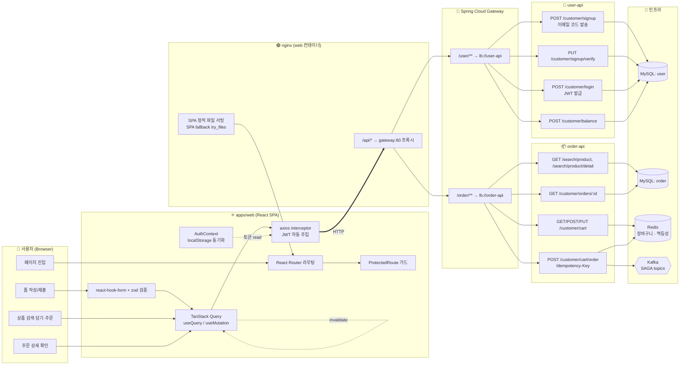
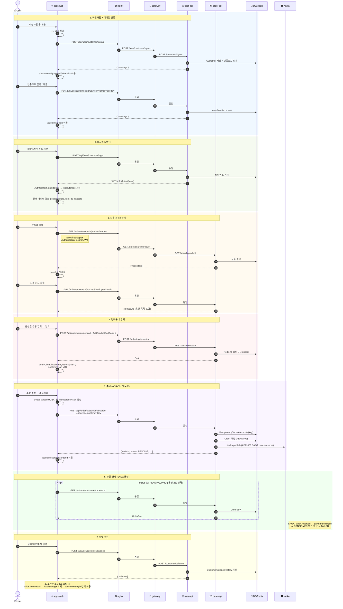

# CUSTOMER Flow

`apps/web` 의 CUSTOMER 화면과 백엔드(user-api / order-api) 사이의 전체 흐름을 swim lane 형식의 flowchart 와 시나리오별 sequence diagram 으로 정리한다.

> 화면 구현: [#43](https://github.com/jameskim9509/CommerceAPI/issues/43) / [#44](https://github.com/jameskim9509/CommerceAPI/pull/44)
> 게이트웨이 라우팅: `/api/user/**` → user-api, `/api/order/**` → order-api (nginx → gateway, ADR-005 Eureka LB)

---

## 1. 전체 구성 (Swim Lane)

각 swim lane = subgraph. 노드는 책임/역할 단위로 묶었고, 점선은 부수 효과(토큰 주입, 캐시 무효화)다.

**핵심 포인트**
- SPA 안의 모든 외부 호출은 `axios` 한 인스턴스를 거치고, **요청 인터셉터가 `localStorage` 의 JWT 를 `Bearer` 로 자동 주입**한다 (`apps/web/src/shared/api/client.ts`).
- 401 응답 시 인터셉터가 토큰을 지우고 `/customer/login` 으로 리다이렉트한다.
- `nginx` 는 SPA 정적 산출물 서빙과 `/api/*` 프록시 두 역할만 한다 (인증 처리 없음).
- gateway 는 service-id 기반 (`lb://user-api`, `lb://order-api`) 로라 Eureka 에서 인스턴스를 동적 발견한다 (ADR-005).

---

## 2. 시나리오별 시퀀스

회원가입부터 주문 상세 폴링까지의 시간 흐름. participant 가 swim lane 역할이고, `Note` 가 사이드 이펙트다.

---

## 3. 화면 ↔ API 매핑

| 화면 (route) | 컴포넌트 | 메서드 + 경로 | 가드 |
|---|---|---|---|
| `/customer/signup` | `Signup.tsx` | `POST /api/user/customer/signup` | 없음 |
| `/customer/signup/verify` | `SignupVerify.tsx` | `PUT  /api/user/customer/signup/verify` | 없음 |
| `/customer/login` | `Login.tsx` | `POST /api/user/customer/login` | 없음 |
| `/customer/products` | `Products.tsx` | `GET  /api/order/search/product?name=` | CUSTOMER |
| `/customer/products/:id` | `ProductDetail.tsx` | `GET  /api/order/search/product/detail` + `POST /api/order/customer/cart` | CUSTOMER |
| `/customer/cart` | `Cart.tsx` | `GET/PUT /api/order/customer/cart` + `POST /api/order/customer/cart/order` (`Idempotency-Key`) | CUSTOMER |
| `/customer/orders` | `Orders.tsx` | (입력 폼만, 백엔드 호출 없음) | CUSTOMER |
| `/customer/orders/:orderId` | `OrderDetail.tsx` | `GET  /api/order/customer/orders/:id` (PENDING/PAID 동안 2 s 폴링) | CUSTOMER |
| `/customer/balance` | `Balance.tsx` | `POST /api/user/customer/balance` | CUSTOMER |

---

## 4. 관련 ADR

- **ADR-001**: 멱등성 키로 결제·주문 중복 방지. SPA 가 `crypto.randomUUID()` 로 키를 만들어 `POST /customer/cart/order` 헤더에 실음.
- **ADR-003**: Choreography SAGA. 주문 생성 직후 응답은 PENDING; SPA 가 `OrderDetail` 에서 2 초 폴링으로 CONFIRMED/FAILED 까지 추적.
- **ADR-005**: Eureka + gateway lb 라우팅. SPA → nginx → gateway → `lb://user-api` / `lb://order-api`.

## 5. 알려진 한계

- `ProductDto` 에 `sellerId` 가 없어 `AddProductCartForm.sellerId` 를 임시로 `0` 전송 (백엔드 응답 보완 후 정정 필요).
- 백엔드에 주문 목록 API 가 없어 `/customer/orders` 는 ID 입력 폼만 제공.
- SELLER 화면은 [#50](https://github.com/jameskim9509/CommerceAPI/issues/50) 으로 분리, `docs/seller-flow.md` 참조.
