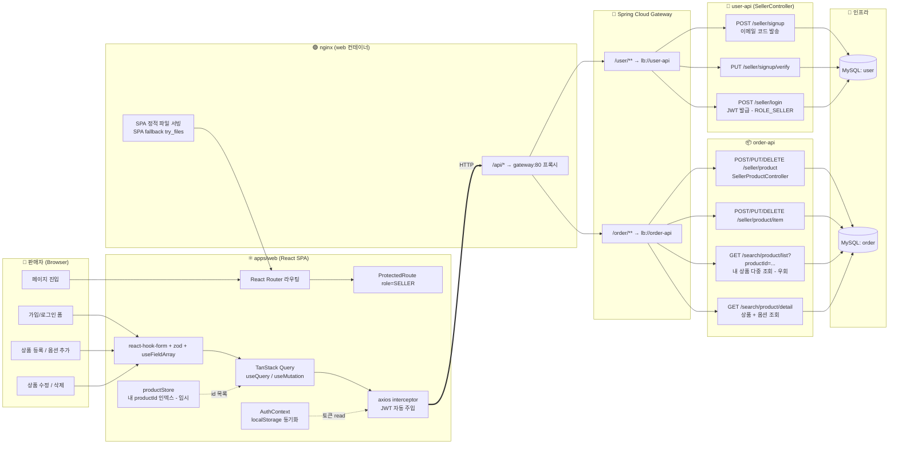

# SELLER Flow

`apps/web` 의 SELLER 화면과 백엔드(user-api / order-api) 사이의 전체 흐름을 swim lane 형식의 flowchart 와 시나리오별 sequence diagram 으로 정리한다. CUSTOMER 흐름과 같은 골격을 따른다 (`docs/customer-flow.md`).

> 화면 구현: [#50](https://github.com/jameskim9509/CommerceAPI/issues/50)
> 게이트웨이 라우팅: `/api/user/**` → user-api, `/api/order/**` → order-api (nginx → gateway, ADR-005 Eureka LB)

---

## 1. 전체 구성 (Swim Lane)

**핵심 포인트**
- 모든 외부 호출은 CUSTOMER 와 동일하게 단일 `axios` 인스턴스를 거치고, JWT 가 `Bearer` 로 자동 주입된다 (`apps/web/src/shared/api/client.ts`).
- 401 응답 시 인터셉터가 토큰을 지우고 `/seller/*` 경로면 `/seller/login`, `/customer/*` 경로면 `/customer/login` 로 리다이렉트한다 (이번 PR 에서 모드별 분기 추가).
- `ProtectedRoute role="SELLER" loginPath="/seller/login"` 로 가드하므로 CUSTOMER 토큰으로는 SELLER 화면에 진입할 수 없다 (반대 모드 토큰 → 같은 모드 로그인 화면으로 강제).
- **알려진 한계 (§6 참조)**: 백엔드에 SELLER 전용 "내 상품 목록" API 가 없어, SPA 가 `productStore` (localStorage) 에 등록한 productId 를 누적하고 `GET /search/product/list?productId=...` 로 일괄 조회한다.

---

## 2. 시나리오별 시퀀스

```mermaid
sequenceDiagram
  autonumber
  actor User as 👤 Seller
  participant SPA as ⚛️ apps/web
  participant LS as 🗄 localStorage<br/>(JWT + productStore)
  participant Nginx as 🟢 nginx
  participant GW as 🚪 gateway
  participant UA as 🧑 user-api
  participant OA as 📦 order-api
  participant DB as 💾 DB

  rect rgb(240, 248, 255)
    Note over User,UA: 1. 회원가입 + 이메일 인증
    User->>SPA: 회원가입 폼 제출
    SPA->>SPA: zod 검증 통과
    SPA->>Nginx: POST /api/user/seller/signup
    Nginx->>GW: POST /user/seller/signup
    GW->>UA: POST /seller/signup
    UA->>DB: Seller 저장 + 인증코드 발송
    UA-->>SPA: { message }
    SPA->>SPA: /seller/signup/verify?email= 이동

    User->>SPA: 인증코드 입력 / 제출
    SPA->>Nginx: PUT /api/user/seller/signup/verify?email=&code=
    Nginx->>GW: 동일
    GW->>UA: 동일
    UA->>DB: emailVerified = true
    UA-->>SPA: { message }
    SPA->>SPA: /seller/login 이동
  end

  rect rgb(245, 250, 240)
    Note over User,UA: 2. 로그인 (JWT - ROLE_SELLER)
    User->>SPA: 이메일/비밀번호 제출
    SPA->>Nginx: POST /api/user/seller/login
    Nginx->>GW: 동일
    GW->>UA: 동일
    UA->>DB: 비밀번호 검증 + verify 여부 확인
    UA-->>SPA: JWT 문자열 (roles=[ROLE_SELLER], id=sellerId)
    SPA->>LS: AuthContext.login(token)<br/>commerce-token 저장
    SPA->>SPA: 원래 가려던 경로 (location.state.from) 로 navigate
  end

  rect rgb(255, 250, 240)
    Note over User,OA: 3. 신규 상품 등록 (Product + Items 일괄)
    User->>SPA: 상품명/설명 + 옵션 1..n 행 입력
    Note right of SPA: react-hook-form useFieldArray<br/>로 옵션 N행 동적 관리
    SPA->>Nginx: POST /api/order/seller/product<br/>{ name, description, addProductItemForms[] }
    Note right of SPA: Authorization: Bearer JWT
    Nginx->>GW: POST /order/seller/product
    GW->>OA: POST /seller/product (@PreAuthorize SELLER)
    OA->>DB: Product + ProductItem cascade insert
    OA-->>SPA: AddProductForm.Output { productId, sellerId, ... }
    SPA->>LS: productStore.rememberMyProductId(sellerId, productId)
    SPA->>SPA: /seller/products 이동
  end

  rect rgb(255, 245, 245)
    Note over User,OA: 4. 내 상품 목록 (검색 기반 우회)
    User->>SPA: /seller/products 진입
    SPA->>LS: getMyProductIds(sellerId)
    LS-->>SPA: [101, 102, ...]
    SPA->>Nginx: GET /api/order/search/product/list?productId=101&productId=102
    Nginx->>GW: 동일
    GW->>OA: GET /search/product/list
    OA->>DB: productRepository.findAllById(ids)
    OA-->>SPA: ProductDto[] (옵션 포함)
    SPA->>SPA: card-list 렌더링 + [수정/삭제] 액션
  end

  rect rgb(250, 245, 255)
    Note over User,OA: 5. 상품 수정 (메타 + 옵션 행별)
    User->>SPA: /seller/products/:id/edit
    SPA->>Nginx: GET /api/order/search/product/detail?productId=:id
    Nginx->>GW: 동일
    GW->>OA: GET /search/product/detail
    OA-->>SPA: ProductDto

    alt 상품 정보(name/description) 저장
      User->>SPA: [상품 정보 저장] 클릭
      SPA->>Nginx: PUT /api/order/seller/product<br/>{ productId, name, description, updateProductItemForms:[] }
      Nginx->>GW: 동일
      GW->>OA: PUT /seller/product (@PreAuthorize SELLER)
      OA->>DB: Product 메타 갱신
      OA-->>SPA: UpdateProductForm.Output
    end

    alt 옵션 1행 신규 추가
      User->>SPA: [추가] 클릭
      SPA->>Nginx: POST /api/order/seller/product/item<br/>{ productId, name, price, count }
      Nginx->>GW: 동일
      GW->>OA: POST /seller/product/item
      OA->>DB: ProductItem insert
      OA-->>SPA: AddProductForm.Output
    end

    alt 옵션 1행 수정
      User->>SPA: [저장] 클릭
      SPA->>Nginx: PUT /api/order/seller/product/item
      Nginx->>GW: 동일
      GW->>OA: PUT /seller/product/item
      OA->>DB: ProductItem update
      OA-->>SPA: UpdateProductItemForm.Output
    end

    alt 옵션 1행 삭제
      User->>SPA: [삭제] 클릭 → confirm
      SPA->>Nginx: DELETE /api/order/seller/product/item?id=
      Nginx->>GW: 동일
      GW->>OA: DELETE /seller/product/item
      OA->>DB: ProductItem delete
      OA-->>SPA: "success"
    end

    SPA->>SPA: queryClient.invalidateQueries(['product', id], ['seller','products'])
  end

  rect rgb(240, 255, 240)
    Note over User,OA: 6. 상품 삭제
    User->>SPA: 목록에서 [삭제] 클릭 → confirm
    SPA->>Nginx: DELETE /api/order/seller/product?id=
    Nginx->>GW: 동일
    GW->>OA: DELETE /seller/product
    OA->>DB: Product + ProductItem cascade delete
    OA-->>SPA: "success"
    SPA->>LS: productStore.forgetMyProductId(sellerId, id)
    SPA->>SPA: 목록 캐시 invalidate
  end

  Note over SPA: ⚠️ 토큰 만료 / 401 응답 시<br/>axios interceptor → localStorage 삭제 → /seller/login 강제 이동
```

---

## 3. 화면 ↔ API 매핑

| 화면 (route) | 컴포넌트 | 메서드 + 경로 | 가드 |
|---|---|---|---|
| `/seller/signup` | `Signup.tsx` | `POST /api/user/seller/signup` | 없음 |
| `/seller/signup/verify` | `SignupVerify.tsx` | `PUT  /api/user/seller/signup/verify` | 없음 |
| `/seller/login` | `Login.tsx` | `POST /api/user/seller/login` | 없음 |
| `/seller` (index) | `Home.tsx` | 호출 없음 (인사 + 링크) | 없음 |
| `/seller/products` | `Products.tsx` | `GET  /api/order/search/product/list?productId=...` + `DELETE /api/order/seller/product` | SELLER |
| `/seller/products/new` | `ProductNew.tsx` | `POST /api/order/seller/product` (Product + Items 일괄) | SELLER |
| `/seller/products/:id/edit` | `ProductEdit.tsx` | `GET /api/order/search/product/detail` + `PUT /api/order/seller/product` + `POST/PUT/DELETE /api/order/seller/product/item` | SELLER |
| `/seller/orders` | `Orders.tsx` | (placeholder — 백엔드 미구현) | SELLER |

---

## 4. 관련 ADR

- **ADR-005**: Eureka + gateway lb 라우팅. SPA → nginx → gateway → `lb://user-api` / `lb://order-api`. SELLER 호출도 같은 경로를 그대로 탄다.

## 5. CUSTOMER 와의 모드 분리 규칙

- **토큰 저장소는 공용** (`localStorage: commerce-token`) 이지만, 한 번에 하나의 모드만 사용한다 — 새로 로그인하면 이전 토큰을 덮어쓴다.
- `AuthContext` 가 JWT payload 의 `roles` 를 보고 `Role[]` 로 변환 (`ROLE_SELLER → SELLER`), `ProtectedRoute role="SELLER"` 가드는 SELLER 가 아닌 토큰을 `/seller/login` 으로 돌려보낸다.
- axios 401 인터셉터는 현재 URL prefix 로 모드를 판별해 각자 로그인 화면으로 보낸다.
- CUSTOMER ↔ SELLER 헤더에 서로 모드 전환 링크를 두지만, 전환 시에는 재로그인이 필요하다.

## 6. 알려진 한계

- **SELLER 전용 "내 상품 목록" API 미존재**: 백엔드 `SellerProductController` 는 POST/PUT/DELETE 만 노출하고 GET 이 없다. 임시 우회로 SPA 가 `productStore` (localStorage) 에 등록한 productId 를 누적하고 `GET /search/product/list?productId=...` 로 일괄 조회한다.
  - 결과적으로 **다른 브라우저/기기에서 로그인하면 본인이 등록한 상품이 보이지 않는다.** 백엔드에 `GET /seller/product?sellerId=` (또는 JWT 기반 자동 필터) 가 추가되면 `productStore` 를 제거해야 한다.
- **SELLER 주문 관리 API 미존재**: 백엔드에 `GET /seller/orders` 가 없어 `/seller/orders` 는 placeholder 다. 현재 주문 상태는 CUSTOMER 모드 `/customer/orders/:id` 에서만 확인 가능.
- `CUSTOMER` 와 마찬가지로 `ProductDto` 응답에 `sellerId` 가 포함되지 않아, CUSTOMER 가 카트에 담을 때는 임시 `sellerId=0` 을 보낸다 (`docs/customer-flow.md` §5 와 동일 한계).
